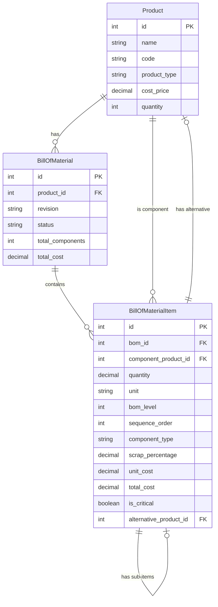
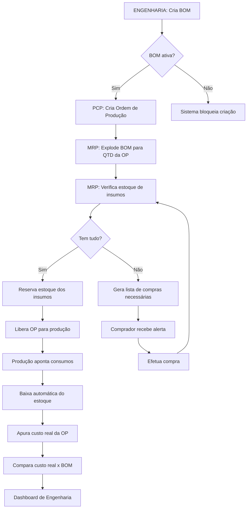
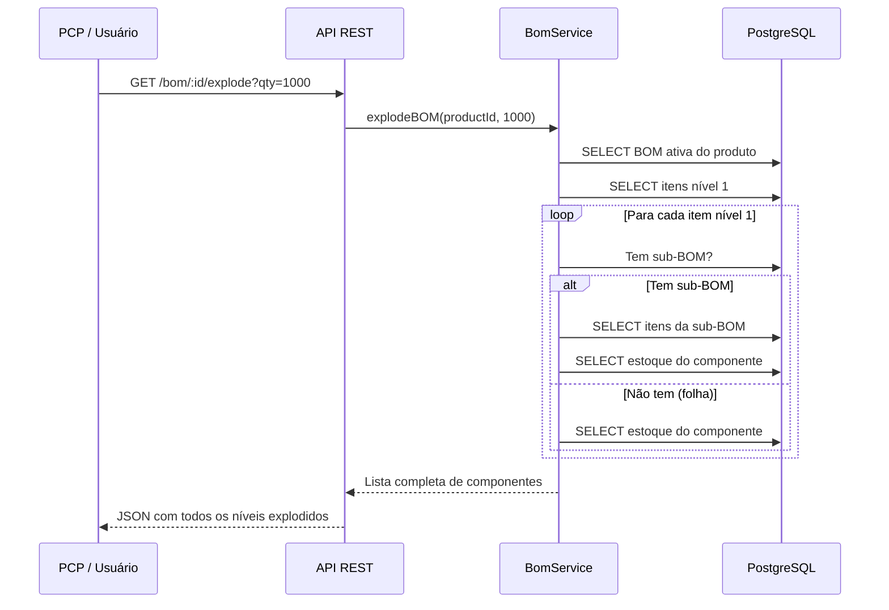

# 📦 Módulo BOM - Bill of Materials (Estrutura do Produto)

**Módulo:** Engenharia do Produto (ver também [01-ENGENHARIA.md](01-ENGENHARIA.md))
**Versão:** 1.0.0
**Aplicação:** ERP EVOK ÁUDIO - Fábrica de Alto-Falantes
**Responsável:** Engenharia do Produto / PCP

---

## 🎯 Papel do Módulo na Fábrica

O módulo **BOM (Bill of Materials)** é o coração da Engenharia do Produto. Ele define **DO QUE** cada alto-falante é feito e **COMO** é montado.

### Por que a BOM é crítica para a EVOK ÁUDIO?

```
🏭 PRODUÇÃO EM MASSA DE ALTO-FALANTES
   │
   ├── 🧾 BOM define: "Alto-falante 12" PRO usa:
   │       ├── Carcaça de alumínio fundido (1 un)
   │       ├── Cone de papel celulose (1 un)
   │       ├── Bobina de cobre 4Ω (1 un)
   │       ├── Imã de Ferrite Y35 (1 un)
   │       ├── Spider Nomex (1 un)
   │       ├── Surround de borracha (1 un)
   │       └── Cola especial (30g)
   │
   ├── 🔄 MRP usa a BOM para calcular (ainda não implementado, ver TODO.md):
   │       ├── Quanto comprar de cada insumo
   │       ├── Quando comprar (baseado em lead time)
   │       └── Custo real do produto
   │
   └── 📊 CUSTOS usa a BOM para (ver 05-CUSTOS.md):
           ├── Custo de matéria-prima
           ├── Custo de componentes
           └── Custo total de fabricação
```

### Exemplo Real

```
BOM: Alto-Falante 12" Série PRO (código: AF-12PRO)
Revisão: 03 | Status: Active | Data: 2025-04-01

NÍVEL 0: Alto-Falante 12" PRO
  ├── NÍVEL 1: Carcaça de alumínio (AF-CAR-12) - 1 un - R$ 25,00
  ├── NÍVEL 1: Conjunto Móvel (AF-CM-12) - 1 un - R$ 18,50  ← TEM SUB-BOM
  │   ├── NÍVEL 2: Cone celulose (AF-CONE-12) - 1 un - R$ 8,00
  │   ├── NÍVEL 2: Bobina 4Ω (AF-BOB-12) - 1 un - R$ 6,50
  │   │   ├── NÍVEL 3: Fio cobre AWG 28 (MAT-FIO-28) - 50g - R$ 2,00
  │   │   └── NÍVEL 3: Tubete Kapton (MAT-TUB-12) - 1 un - R$ 1,50
  │   ├── NÍVEL 2: Spider Nomex (AF-SPI-12) - 1 un - R$ 2,50
  │   └── NÍVEL 2: Surround borracha (AF-SUR-12) - 1 un - R$ 1,50
  ├── NÍVEL 1: Imã Ferrite Y35 (AF-IMA-12) - 1 un - R$ 12,00
  ├── NÍVEL 1: Terminal PCB (AF-TERM-12) - 2 un - R$ 1,50
  └── NÍVEL 1: Cola epóxi (MAT-COLA) - 30g - R$ 0,90
                                    ─────────
                    CUSTO TOTAL:   R$ 57,90
```

---

## 📋 Estrutura de Arquivos

```
server/src/
├── models/
│   ├── index.ts                    # Registro de modelos e relacionamentos
│   ├── BillOfMaterial.ts           # Modelo da BOM (cabeçalho)
│   └── BillOfMaterialItem.ts       # Modelo dos itens (componentes)
├── controllers/
│   └── bomController.ts            # Controlador REST
├── services/
│   └── bomService.ts               # Serviço com regras de negócio
└── routes/
    └── bom.ts                      # Rotas Express
```

---

## 🗄️ Modelos de Dados

### BillOfMaterial (bill_of_materials)

| Campo | Tipo | Descrição |
|-------|------|-----------|
| id | INT (PK) | Identificador único |
| product_id | INT (FK) | Produto acabado |
| revision | VARCHAR(10) | Revisão da BOM |
| status | ENUM | draft, active, inactive, superseded |
| total_components | INT | Cache: total de itens |
| total_cost | DECIMAL(12,2) | Cache: custo total |
| created_by | INT (FK) | Usuário criador |
| approved_by | INT (FK) | Usuário aprovador |
| approval_date | DATE | Data de aprovação |

### BillOfMaterialItem (bill_of_material_items)

| Campo | Tipo | Descrição |
|-------|------|-----------|
| id | INT (PK) | Identificador único |
| bom_id | INT (FK) | BOM à qual pertence |
| component_product_id | INT (FK) | Produto/insumo componente |
| quantity | DECIMAL(12,4) | Quantidade por unidade do pai |
| unit | VARCHAR(10) | un, g, kg, m, l |
| bom_level | INT | Nível hierárquico (0-10) |
| parent_item_id | INT (FK) | Auto-relacionamento (sub-itens) |
| sequence_order | INT | Ordem de montagem |
| component_type | ENUM | raw_material, component, semi_finished, packaging, consumable |
| scrap_percentage | DECIMAL(5,2) | % de perda técnica |
| unit_cost | DECIMAL(12,2) | Cache: custo unitário |
| total_cost | DECIMAL(12,2) | Cache: custo total com perda |
| is_critical | BOOLEAN | Item crítico (alerta MRP) |
| alternative_product_id | INT (FK) | Produto substituto aprovado |

### Relacionamentos



---

## 🎮 Endpoints da API

### CRUD - BOM

| Método | Rota | Descrição | Autenticação |
|--------|------|-----------|--------------|
| `GET` | `/api/engineering/bom` | Lista BOMs (paginado) | JWT |
| `GET` | `/api/engineering/bom/product/:productId` | BOM ativa de um produto | JWT |
| `GET` | `/api/engineering/bom/:id` | Detalhes da BOM + itens | JWT |
| `POST` | `/api/engineering/bom` | Criar nova BOM | JWT |
| `PUT` | `/api/engineering/bom/:id` | Atualizar dados da BOM | JWT |
| `DELETE` | `/api/engineering/bom/:id` | Inativar BOM | JWT |
| `GET` | `/api/engineering/bom/:id/items` | Listar itens da BOM | JWT |

### Operações de Engenharia

| Método | Rota | Descrição | Parâmetros |
|--------|------|-----------|------------|
| `GET` | `/api/engineering/bom/:id/explode` | Explodir BOM p/ qty | `?qty=1000` |
| `GET` | `/api/engineering/bom/:id/cost` | Calcular custo | `?qty=1` |
| `GET` | `/api/engineering/bom/:id/availability` | Verificar estoque | `?qty=1000` |
| `GET` | `/api/engineering/bom/:id/tree` | Árvore hierárquica | - |

### Exemplos de Requisição

#### 1. Criar BOM

```http
POST /api/engineering/bom
Authorization: Bearer <token>
Content-Type: application/json

{
  "product_id": 1,
  "revision": "01",
  "revision_notes": "Substituído imã Ferrite Y30 por Y35",
  "notes": "BOM para Alto-Falante 12\" Série PRO",
  "items": [
    {
      "component_product_id": 10,
      "quantity": 1,
      "unit": "un",
      "bom_level": 1,
      "sequence_order": 1,
      "component_type": "component",
      "scrap_percentage": 0.5,
      "notes": "Carcaça alumínio fundido"
    },
    {
      "component_product_id": 11,
      "quantity": 1,
      "unit": "un",
      "bom_level": 1,
      "sequence_order": 2,
      "component_type": "component",
      "is_critical": true
    },
    {
      "component_product_id": 16,
      "quantity": 30,
      "unit": "g",
      "bom_level": 1,
      "sequence_order": 8,
      "component_type": "consumable",
      "scrap_percentage": 5.0,
      "notes": "Aplicar em temperatura ambiente"
    }
  ]
}
```

#### 2. Explodir BOM (para 1000 unidades)

```http
GET /api/engineering/bom/1/explode?qty=1000
Authorization: Bearer <token>
```

Response:
```json
{
  "success": true,
  "data": {
    "bom_id": 1,
    "product_id": 1,
    "product_name": "Alto-Falante 12\" PRO",
    "requested_quantity": 1000,
    "total_cost": 57900.00,
    "total_components": 12,
    "components": [
      {
        "component_id": 10,
        "component_name": "Carcaça alumínio",
        "component_code": "AF-CAR-12",
        "component_type": "component",
        "quantity": 1000,
        "unit_cost": 25.00,
        "total_cost": 25000.00,
        "stock_available": 850,
        "is_critical": false,
        "bom_level": 1
      },
      {
        "component_id": 16,
        "component_name": "Cola epóxi",
        "component_code": "MAT-COLA",
        "component_type": "consumable",
        "quantity": 31500,
        "unit_cost": 0.03,
        "total_cost": 945.00,
        "stock_available": 50000,
        "is_critical": false,
        "bom_level": 1,
        "scrap_percentage": 5.0
      }
    ],
    "summary": {
      "by_type": { "component": 8, "raw_material": 2, "consumable": 2 },
      "low_stock_items": [
        { "component_id": 10, "deficit": 150 }
      ],
      "critical_items": [
        { "component_id": 11, "is_critical": true }
      ]
    }
  }
}
```

#### 3. Verificar Disponibilidade

```http
GET /api/engineering/bom/1/availability?qty=1000
Authorization: Bearer <token>
```

Response:
```json
{
  "success": true,
  "data": {
    "product_id": 1,
    "product_name": "Alto-Falante 12\" PRO",
    "requested_quantity": 1000,
    "available": false,
    "max_possible_quantity": 850,
    "total_components_checked": 12,
    "missing_items": [
      {
        "component_id": 10,
        "component_name": "Carcaça alumínio",
        "needed": 1000,
        "available": 850,
        "deficit": 150,
        "suggestion": "Comprar 150.00 un"
      }
    ]
  }
}
```

---

## 🔄 Fluxo de Negócio

### Fluxo: Criação de OP com BOM

> Fluxo **alvo**. Hoje só os passos "Cria BOM" e "Explode BOM" (via `GET /explode`) existem no código. O restante (reserva automática de estoque, geração de lista de compras, apontamento de consumo) depende do MRP e do apontamento de produção, ainda não implementados — ver `docs/BLACKBOX_CRONOGRAMA_CHECKLIST.md.



### Diagrama de Sequência (Explosão de BOM)



### Diagrama de Hierarquia (Árvore da BOM)

```mermaid
graph TD
    subgraph "NÍVEL 0 - Produto Acabado"
        AF12["Alto-Falante 12\" PRO"]
    end

    subgraph "NÍVEL 1 - Componentes Diretos"
        CAR["Carcaça alumínio<br/>1 un"]
        CM["Conjunto Móvel<br/>1 un"]
        IMA["Imã Ferrite<br/>1 un"]
        TER["Terminal<br/>2 un"]
        COL["Cola epóxi<br/>30g"]
    end

    subgraph "NÍVEL 2 - Subcomponentes"
        CONE["Cone celulose<br/>1 un"]
        BOB["Bobina 4Ω<br/>1 un"]
        SPI["Spider Nomex<br/>1 un"]
        SUR["Surround borracha<br/>1 un"]
    end

    subgraph "NÍVEL 3 - Matéria-Prima"
        FIO["Fio cobre AWG28<br/>50g"]
        TUB["Tubete Kapton<br/>1 un"]
    end

    AF12 --> CAR
    AF12 --> CM
    AF12 --> IMA
    AF12 --> TER
    AF12 --> COL

    CM --> CONE
    CM --> BOB
    CM --> SPI
    CM --> SUR

    BOB --> FIO
    BOB --> TUB
```

---

## 🛠️ Regras de Negócio Implementadas

### 1. Versionamento de BOM
- Toda alteração na BOM gera nova revisão
- BOMs anteriores ficam `superseded` (substituídas)
- Apenas uma BOM `active` por produto

### 2. Validação de Componentes
- Só produtos acabados (`product_type = 'finished'`) têm BOM master
- Componentes podem ser: raw_material, component, semi_finished, packaging, consumable, other
- Quantidade deve ser maior que zero (mínimo 0.0001)
- Percentual de perda técnica (`scrap_percentage`) entre 0 e 100%
- Nível hierárquico (`bom_level`) entre 0 e 10 — a explosão recursiva para automaticamente em profundidade 10 para evitar loop infinito em BOM mal cadastrada (`BomService.MAX_BOM_DEPTH`)
