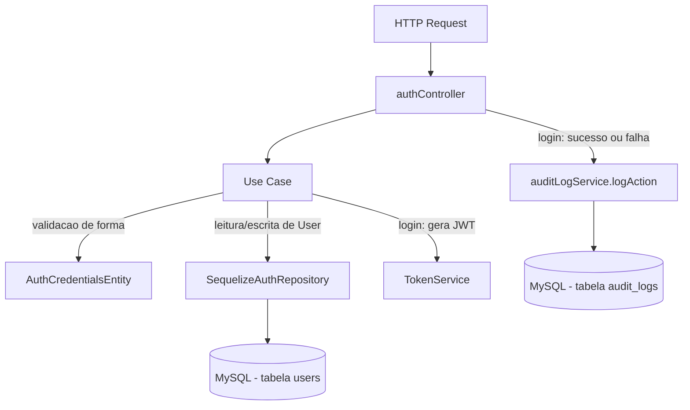

# Módulo Auth

## Objetivo

Gerenciar autenticação e criação de usuários do ERP: login (emissão de
token JWT), registro de novos usuários (restrito a administradores) e
leitura dos dados do usuário autenticado. Migrado para a arquitetura em
camadas (`domain` / `application` / `infrastructure` / `presentation`)
descrita na Fase 5 do `TODO.md`, seguindo o mesmo padrão dos módulos
`products`, `inventory`, `bom`, `production`, `purchases`, `sales` e
`financial`.

Este módulo **não reimplementa** hashing/comparação de senha nem a
sanitização de `password` nas respostas — isso continua 100% centralizado
no model `server/src/models/User.js` (`comparePassword`, hook
`beforeSave` que faz o hash, `toJSON` que remove `password`). Os use cases
deste módulo são wrappers finos sobre esse model (via `AuthRepository`) e
sobre `jsonwebtoken` (via `TokenService`).

## Decisão de compatibilidade de rotas

O endpoint `/api/auth` (mesmos 3 paths, métodos, middlewares e formato de
sucesso JSON do controller legado) agora é servido pelas rotas/controller
deste módulo (`presentation/routes/auth.js` →
`presentation/controllers/authController.js`), registrado em
`server/index.js`.

O arquivo legado `server/src/routes/auth.js` e o controller
`server/src/controllers/authController.js` **permanecem no repositório**
como referência histórica, mas **não são mais montados em nenhuma rota** —
evitando duplicidade de `/api/auth` e o risco de duas implementações
divergentes atenderem à mesma URL. Confirmado via `grep` que apenas
`server/index.js` monta o módulo novo (`require('./src/modules/auth/...')`),
nenhuma outra ocorrência de `require('./src/routes/auth')` existe no
arquivo. Os arquivos legados podem ser removidos em uma limpeza futura, uma
vez confirmada a estabilidade da migração.

Nenhum client precisa mudar quanto a **sucesso**: mesmos 3 endpoints,
mesmos verbos HTTP, mesmos middlewares (`authenticate` + `authorize('admin')`
em `POST /register`), mesmo envelope `{ success: true, data }`.

Uma diferença de formato existe apenas nas respostas de **erro** (mesmo
padrão já adotado nos módulos `inventory`/`bom`/`production`/`purchases`/
`sales`/`financial` migrados anteriormente): erros de validação/negócio
agora são instâncias de `AppError` (`server/src/errors`) e chegam ao
cliente como `{ success: false, error: { code, message } }` em vez do
`{ success: false, error: "mensagem em string" }` usado pelo controller
legado. O `statusCode` HTTP retornado é o mesmo em todos os casos (400,
401, 403, 409). Erros inesperados (5xx) mantêm o fallback genérico do
`errorHandler`, igual ao legado. `docs/API.md` foi atualizado para refletir
o novo formato do erro 401 de `/login`.

**Regra de segurança preservada 1:1 (não alterada por esta migração):** a
mensagem de erro em `POST /login` é **propositalmente idêntica**
(`'Email ou senha incorretos'`) tanto para "email não encontrado" quanto
para "senha incorreta" — apenas o `errorMessage` interno enviado à
auditoria (`AuditLog`, nunca exposto ao cliente) difere entre os dois
casos. Isso evita que um atacante descubra, por tentativa e erro, quais
emails estão cadastrados no sistema. Essa regra está centralizada em
`LoginUseCase#execute` e **não deve ser alterada**.

## Estrutura

```
server/src/modules/auth/
  domain/
    entities/AuthCredentialsEntity.js   LoginCredentialsEntity + RegisterUserEntity (validação de forma)
    repositories/AuthRepository.js      Interface do repositório
  application/
    use-cases/
      LoginUseCase.js                   Autentica, gera token, monta payload de auditoria (sucesso e falha)
      RegisterUserUseCase.js            Cria usuário (role padrão 'operator', trata email duplicado)
      GetMeUseCase.js                   Relê o usuário autenticado pelo id
  infrastructure/
    sequelize/SequelizeAuthRepository.js Implementação usando o model User existente
    jwt/TokenService.js                 Wrapper sobre jsonwebtoken (geração de token)
  presentation/
    controllers/authController.js
    routes/auth.js
```

## Modelos de dados utilizados

- `server/src/models/User.js` (Sequelize, reutilizado — nenhum model novo
  foi criado). Fornece `comparePassword` (bcryptjs), hash de senha via hook
  `beforeSave` e `toJSON` que remove `password` das serializações padrão
  (não usado diretamente aqui, pois os repositórios já excluem `password`
  via `attributes: { exclude: ['password'] }` quando aplicável, mesmo
  comportamento do legado).

## Regras de negócio

- **Login:** `email`/`password` obrigatórios (forma, validada por
  `LoginCredentialsEntity`). Se o email não existir, a senha não conferir,
  ou o usuário estiver inativo, a requisição falha com 401 — mensagem
  genérica idêntica para email/senha incorretos (ver seção de segurança
  acima); usuário inativo tem mensagem própria (`'Usuário inativo. Contate
  o administrador.'`). Toda tentativa (sucesso ou falha) é auditada via
  `logAction`.
- **Registro:** `name`/`email`/`password` obrigatórios; email deve casar
  com a regex `/^[^\s@]+@[^\s@]+\.[^\s@]+$/`; senha deve ter no mínimo 6
  caracteres (forma, validada por `RegisterUserEntity`). `role` padrão
  `'operator'` quando não informado. Email duplicado (constraint única do
  banco) retorna 409 com mensagem `'Email já cadastrado'`.
- **Me:** apenas relê o usuário autenticado (`req.user.id`, injetado pelo
  middleware `authenticate`) sem o campo `password`.

## Endpoints

Base URL: `/api/auth`.

| Método | Rota | Middlewares | Descrição |
|---|---|---|---|
| POST | `/api/auth/login` | nenhum (público) | Autentica por email/senha e retorna token JWT + usuário |
| POST | `/api/auth/register` | `authenticate`, `authorize('admin')` | Cria um novo usuário |
| GET | `/api/auth/me` | `authenticate` | Retorna o usuário autenticado |

Ver `docs/API.md` (seção "1. Autenticação") para exemplos completos de
request/response.

## Permissões

- `POST /login`: público (sem JWT).
- `POST /register`: exige JWT válido e papel `'admin'` (`authorize('admin')`).
- `GET /me`: exige apenas JWT válido (qualquer papel).

Mesmas regras do controller/rotas legados — nenhuma mudança de RBAC nesta
migração.

## Eventos / Auditoria

`POST /login` chama `logAction` (via
`server/src/services/auditLogService.js`) em **todos** os desfechos —
sucesso e cada um dos três motivos de falha (email não encontrado, senha
incorreta, usuário inativo) — preservando o comportamento do controller
legado de auditar tentativas de login mal-sucedidas. Como o `LoginUseCase`
não tem acesso a `req`, ele retorna (em caso de sucesso) ou anexa ao erro
lançado (em caso de falha, via `error.audit`) o payload pronto para
`logAction`; o controller é responsável por chamar `logAction(req, ...)`
antes de responder/repassar o erro.

`POST /register` e `GET /me` não geram auditoria, mesmo comportamento do
legado (o controller legado nunca chamava `logAction` nesses dois
endpoints).

## Fluxo simplificado (Mermaid)



## Testes existentes

Nenhum teste automatizado existe hoje para este módulo (nem para o
restante do projeto — `server/tests/` ainda não existe). Cobertura de
testes unitários de `LoginUseCase`/`RegisterUserUseCase` e testes de
integração dos 3 endpoints está prevista na Fase 9 do `TODO.md`.

## Pendências conhecidas

- Não há refresh token nem revogação de token (logout é apenas client-side,
  descartando o JWT armazenado) — mesmo comportamento do legado.
- Validação de entrada é manual/via entidade (sem schema declarativo);
  migração para Zod está prevista para a Fase 8.
- O controller/rota legados (`server/src/controllers/authController.js`,
  `server/src/routes/auth.js`) foram deixados intactos no repositório como
  referência histórica, mas não são mais usados; podem ser removidos em
  limpeza futura.
