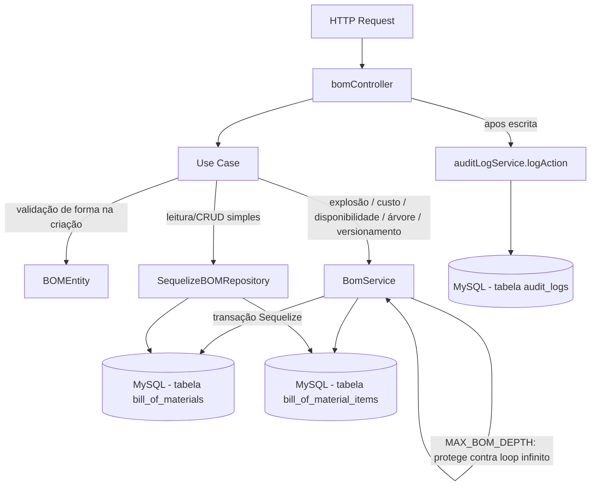

# Módulo BOM (Bill of Materials — Estrutura de Produto)

## Objetivo

Gerenciar a Estrutura de Produto (BOM) da fábrica de alto-falantes: quais
componentes/matérias-primas compõem cada produto acabado, em que
quantidade, e as regras de engenharia derivadas dessa estrutura — explosão
de necessidades (para o MRP), cálculo de custo, verificação de
disponibilidade de estoque para produção e visualização em árvore
hierárquica (para produtos com subconjuntos/sub-BOMs).

É o terceiro módulo migrado para a arquitetura em camadas (`domain` /
`application` / `infrastructure` / `presentation`) descrita nas Fases 5/6
do `TODO.md`, seguindo o mesmo padrão dos módulos `products` e `inventory`.

Este módulo **não reimplementa** a lógica de negócio complexa de BOM
(explosão recursiva com proteção contra loop infinito via `MAX_BOM_DEPTH`,
cálculo de custo por nível, verificação de disponibilidade, versionamento
automático via `status: 'superseded'`) — essa lógica continua 100%
centralizada em `server/src/services/bomService.js` (`BomService`). Os use
cases deste módulo são wrappers finos que chamam `BomService` ou o
`SequelizeBOMRepository` (para as operações de leitura/CRUD simples que já
eram feitas via query direta no controller legado).

## Decisão de compatibilidade de rotas

O endpoint `/api/engineering/bom` (mesmos paths, métodos e formato de
resposta JSON dos 11 endpoints existentes) agora é servido pelas
rotas/controller deste módulo (`presentation/routes/bom.js` →
`presentation/controllers/bomController.js`), registrado em
`server/index.js`.

Os arquivos legados `server/src/routes/bom.js` e
`server/src/controllers/bomController.js` **permanecem no repositório**
como referência histórica, mas **não são mais montados em nenhuma rota** —
evitando duplicidade de `/api/engineering/bom` e o risco de duas
implementações divergentes atenderem à mesma URL. Podem ser removidos em
uma limpeza futura, uma vez confirmada a estabilidade da migração.

Nenhum client precisa mudar: mesmos paths, mesmos verbos HTTP, mesmo
envelope `{ success, data }` / `{ success, error }`. Erros lançados por
`BomService` (objetos `Error` simples com `statusCode`, não `AppError`)
continuam retornando `{ success: false, error: "mensagem" }` igual ao
controller legado — o controller do módulo detecta esse formato
(`error.statusCode && !error.code`) e responde da mesma forma. Erros de
validação de forma lançados por `BOMEntity`/use cases usam `ValidationError`,
`NotFoundError` e `BusinessRuleError` (`server/src/errors`) e chegam ao
cliente como `error: { code, message }`, seguindo o padrão adotado desde a
Fase 4.1.

Endpoint novo (aditivo, não quebra nada existente): `GET
/api/engineering/bom/product/:productId/versions` — lista todas as versões
(qualquer status: `draft`/`active`/`inactive`/`superseded`) de BOM de um
produto, ordenadas por data de criação. Não existia no controller legado.

### Decisões de desenho dos use cases (mapeamento com a Fase 6 do TODO.md)

| Use case previsto no TODO | Implementado como | Observação |
|---|---|---|
| `CreateBOMUseCase` | `CreateBOMUseCase` | Wrapper de `BomService.createBOM`. Já cuida do versionamento automático (marca BOMs ativas anteriores do produto como `superseded`). |
| `ApproveBOMUseCase` | `ApproveBOMUseCase` | Wrapper dedicado que atualiza apenas `status: 'active'`. **Não é usado pela rota `PUT /:id`** hoje (ver abaixo); disponível para fluxos futuros de aprovação isolada. |
| `SupersedeBOMUseCase` | **Não criado como use case HTTP distinto** | `BomService.createBOM` já executa o supersede automaticamente como parte da criação de uma nova BOM ativa — não existe (nem existia no controller legado) um endpoint HTTP para "supersede manual" isolado. Criar um use case sem endpoint correspondente violaria o princípio de não adicionar código morto. |
| `ExplodeBOMUseCase` | `ExplodeBOMUseCase` | Wrapper de `BomService.explodeBOM`. |
| `CalculateBOMCostUseCase` | `CalculateBOMCostUseCase` | Wrapper de `BomService.calculateCost`. |
| `CheckBOMAvailabilityUseCase` | `CheckBOMAvailabilityUseCase` | Wrapper de `BomService.checkAvailability`. |
| `GetBOMTreeUseCase` | `GetBOMTreeUseCase` | Wrapper de `BomService.getBOMTree`. |
| `ListBOMVersionsUseCase` | `ListBOMVersionsUseCase` | Novo endpoint aditivo `GET /product/:productId/versions` (não existia antes). |
| — | `ListBOMsUseCase`, `GetBOMByIdUseCase`, `GetActiveBOMByProductUseCase`, `UpdateBOMUseCase`, `DeactivateBOMUseCase`, `ListBOMItemsUseCase` | Cobrem os demais endpoints legados (`list`, `getById`, `getByProduct`, `update`, `remove`, `listItems`). |

**Sobre `PUT /:id` e a dualidade Approve/Update:** o controller legado
tinha um único método `update` que aceitava todos os campos
(`revision`, `revision_notes`, `notes`, `status`) em uma única chamada, e
apenas *detectava* — via comparação de `status` antes/depois — se a
atualização era uma "aprovação" (`status` mudando para `active`) para fins
de log de auditoria (`action: 'approve'` vs `action: 'update'`). Para
preservar 100% esse comportamento (inclusive o caso de enviar `status` e
outros campos juntos no mesmo `PUT`), a rota `PUT /api/engineering/bom/:id`
usa sempre `UpdateBOMUseCase` (que aceita todos os campos permitidos) e o
controller replica a mesma lógica de detecção `isApproval` apenas para
decidir a `action` do log de auditoria. `ApproveBOMUseCase` foi criado
como use case dedicado (conforme pedido pela Fase 6 do TODO.md) e é
funcionalmente equivalente a invocar `UpdateBOMUseCase` apenas com
`{ status: 'active' }`; fica disponível para uso por outros
controllers/fluxos que precisem de uma operação de aprovação isolada (ex.:
um futuro workflow de aprovação de engenharia com múltiplas etapas), mas
não é chamado pela rota HTTP genérica de update hoje, para não quebrar o
contrato existente de multi-campo por requisição.

## Estrutura

```
server/src/modules/bom/
  domain/
    entities/BOMEntity.js                    Validação de forma na criação
    repositories/BOMRepository.js            Interface do repositório
  application/
    use-cases/
      ListBOMsUseCase.js
      GetBOMByIdUseCase.js
      GetActiveBOMByProductUseCase.js
      ListBOMVersionsUseCase.js              Novo
      CreateBOMUseCase.js                    Wrapper fino sobre BomService.createBOM
      UpdateBOMUseCase.js
      ApproveBOMUseCase.js                   Disponível, não usado pela rota PUT hoje (ver acima)
      DeactivateBOMUseCase.js
      ExplodeBOMUseCase.js                   Wrapper fino sobre BomService.explodeBOM
      CalculateBOMCostUseCase.js             Wrapper fino sobre BomService.calculateCost
      CheckBOMAvailabilityUseCase.js         Wrapper fino sobre BomService.checkAvailability
      GetBOMTreeUseCase.js                   Wrapper fino sobre BomService.getBOMTree
      ListBOMItemsUseCase.js
  infrastructure/
    sequelize/SequelizeBOMRepository.js      Implementação usando os models BillOfMaterial/BillOfMaterialItem/Product existentes
  presentation/
    controllers/bomController.js
    routes/bom.js
```

## Modelos de dados utilizados

- `server/src/models/BillOfMaterial.js` (Sequelize, reutilizado — nenhum model novo foi criado).
- `server/src/models/BillOfMaterialItem.js` (Sequelize, reutilizado).
- `server/src/models/Product.js` (leitura: produto acabado e componentes; escrita de custo/estoque não é feita por este módulo).

## Regras de negócio

- `product_id` e `items` (lista não vazia, cada item com `component_product_id` e `quantity > 0`) são obrigatórios na criação — validado por `BOMEntity` (forma).
- Produto da BOM deve ser do tipo `finished` (`Product.product_type === 'finished'`) — validado por `BomService.createBOM`, não duplicado no use case.
- Todo `component_product_id` informado deve existir como produto — validado por `BomService.createBOM`.
- Versionamento: ao criar uma nova BOM para um produto, todas as BOMs com `status = 'active'` desse produto são automaticamente marcadas como `status = 'superseded'` — 100% em `BomService.createBOM`.
- Apenas BOMs em `status` `draft` ou `active` podem ser inativadas (`DELETE /:id`) — validado por `DeactivateBOMUseCase` (`BusinessRuleError` HTTP 422).
- Explosão de BOM (`ExplodeBOMUseCase`/`BomService.explodeBOM`) suporta sub-BOMs (componente que é, por sua vez, produto acabado de outra BOM ativa) recursivamente, com profundidade máxima `BomService.MAX_BOM_DEPTH = 10` para evitar loops infinitos por referência circular.
- Cálculo de custo (`CalculateBOMCostUseCase`) usa `Product.cost_price` de cada componente na explosão, aplicando percentual de perda (`scrap_percentage`) por item.
- Disponibilidade (`CheckBOMAvailabilityUseCase`) compara a quantidade necessária de cada componente (após explosão) com `Product.quantity` em estoque, retornando itens em falta e a quantidade máxima produzível com o estoque atual.

## Endpoints

Base URL: `/api/engineering/bom` (autenticação obrigatória via middleware `authenticate` em todas as rotas).

| Método | Rota | Descrição |
|---|---|---|
| GET | `/api/engineering/bom` | Lista BOMs (filtros: `status`, `product_id`, `search`; paginação: `page`, `limit`) |
| GET | `/api/engineering/bom/product/:productId/versions` | **Novo.** Lista todas as versões (qualquer status) de BOM de um produto, ordenadas por criação |
| GET | `/api/engineering/bom/product/:productId` | Retorna a BOM ativa de um produto |
| GET | `/api/engineering/bom/:id` | Detalhes da BOM (com itens) |
| POST | `/api/engineering/bom` | Cria BOM (supersede automático das BOMs ativas anteriores do produto) |
| PUT | `/api/engineering/bom/:id` | Atualiza dados gerais (`revision`, `revision_notes`, `notes`, `status`) |
| DELETE | `/api/engineering/bom/:id` | Inativa (soft delete) a BOM |
| GET | `/api/engineering/bom/:id/explode?qty=` | Explode a BOM para a quantidade informada |
| GET | `/api/engineering/bom/:id/cost?qty=` | Calcula custo total/unitário baseado na BOM ativa |
| GET | `/api/engineering/bom/:id/availability?qty=` | Verifica disponibilidade de estoque para produzir |
| GET | `/api/engineering/bom/:id/tree` | Retorna a árvore hierárquica da BOM |
| GET | `/api/engineering/bom/:id/items` | Lista os itens de uma BOM |

Ver `docs/API.md` para exemplos completos de request/response.

## Permissões

Todas as rotas exigem JWT válido (`authenticate`). O projeto ainda não
possui um middleware de RBAC granular por rota neste módulo — qualquer
usuário autenticado pode criar/aprovar/inativar BOMs hoje. Isso está
listado como pendência na Fase 12 do `TODO.md` ("Revisar RBAC completo").

## Eventos / Auditoria

Os endpoints de escrita continuam chamando `logAction` (via
`server/src/services/auditLogService.js`), preservando o comportamento do
controller legado:

- `POST /` → `action: 'create'`, entidade `BOM`, com `product_id`, `revision` e `items_count`.
- `PUT /:id` → `action: 'approve'` quando `status` muda para `active` (comparando `before.status` com o novo valor), ou `action: 'update'` caso contrário; `oldValues`/`newValues` apenas dos campos efetivamente alterados.
- `DELETE /:id` → `action: 'soft_delete'`, com `oldValues: { status: <status anterior> }` e `newValues: { status: 'inactive' }`.

Os demais endpoints (`list`, `getById`, `getByProduct`, `listVersions`,
`explode`, `cost`, `availability`, `tree`, `listItems`) são somente
leitura e não geram auditoria, mesmo comportamento do legado.

## Testes existentes

Nenhum teste automatizado existe hoje para este módulo (nem para o
restante do projeto — `server/tests/` ainda não existe). Cobertura de
testes unitários de `BOMEntity`/use cases e testes de integração dos
endpoints está prevista na Fase 9 do `TODO.md`.

## Fluxo simplificado (Mermaid)



## Pendências conhecidas

- `SupersedeBOMUseCase` não foi criado como use case HTTP dedicado — o
  supersede acontece automaticamente dentro de `BomService.createBOM` e
  não existe (nem existia no legado) um endpoint isolado para essa ação.
  Ver decisão detalhada acima.
- `ApproveBOMUseCase` existe mas não é chamado pela rota `PUT /:id` hoje
  (que usa `UpdateBOMUseCase` para preservar o contrato multi-campo do
  legado). Fica disponível para um futuro endpoint dedicado de aprovação
  (ex.: `POST /:id/approve`) ou workflow de aprovação de engenharia.
- Não há workflow formal de aprovação (múltiplos aprovadores, histórico de
  aprovação) — apenas a transição de `status` para `active`.
- Não há RBAC granular por papel neste módulo (qualquer usuário autenticado
  pode criar/aprovar/inativar BOMs).
- Validação de entrada é manual/via entidade (sem schema declarativo);
  migração para Zod está prevista para a Fase 8.
- O controller/rota legados (`server/src/controllers/bomController.js`,
  `server/src/routes/bom.js`) foram deixados intactos no repositório como
  referência histórica, mas não são mais usados; podem ser removidos em
  limpeza futura.
