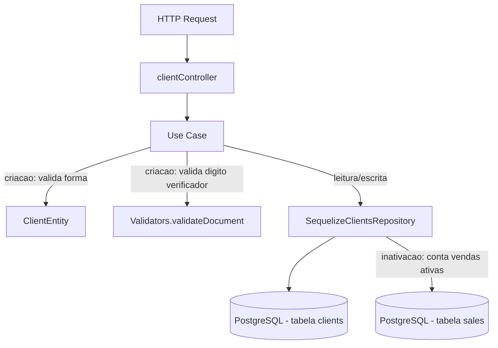

# Módulo Clients

## Objetivo

Gerenciar o cadastro de clientes da fábrica: listagem com
busca/filtro/paginação, consulta individual, criação (com validação de
CPF/CNPJ), atualização de dados cadastrais e inativação (soft delete via
`status='inactive'`), bloqueada quando o cliente possui vendas ativas.
Migrado para a arquitetura em camadas (`domain` / `application` /
`infrastructure` / `presentation`) descrita na Fase 5/6 do `TODO.md`,
seguindo o mesmo padrão dos módulos `users`, `products`, `inventory`,
`bom`, `production`, `purchases`, `sales`, `financial` e `suppliers`.

Este módulo **não reimplementa** a validação de dígito verificador do
CPF/CNPJ: reutiliza `Validators.validateDocument`
(`server/src/utils/validators.ts`), chamada pelo use case
`CreateClientUseCase`, e `Validators.sanitizeSearch` para sanitizar o termo
de busca em `ListClientsUseCase` — mesmas funções já usadas pelo controller
anterior, sem duplicação. Os models Sequelize `Client`
(`server/src/models/Client.ts`) e `Sale` (`server/src/models/Sale.ts`)
também são reutilizados sem alteração.

## Decisão de compatibilidade de rotas

O endpoint `/api/clients` (mesmos 5 paths, métodos, middlewares e formato
de sucesso JSON do controller anterior) agora é servido pelas
rotas/controller deste módulo (`presentation/routes/clients.ts` →
`presentation/controllers/clientController.ts`), registrado em
`server/index.ts`.

O arquivo anterior `server/src/routes/clients.ts` e o controller
`server/src/controllers/clientController.ts` **permanecem no repositório**
como referência histórica, mas **não são mais montados em nenhuma rota** —
evitando duplicidade de `/api/clients` e o risco de duas implementações
divergentes atenderem à mesma URL. Confirmado via `grep` que apenas
`server/index.ts` monta o módulo novo
(`require('./src/modules/clients/presentation/routes/clients')`), nenhuma
outra ocorrência de `require('./src/routes/clients')` existe no arquivo.
Os arquivos anteriors podem ser removidos em uma limpeza futura, uma vez
confirmada a estabilidade da migração.

Nenhum client precisa mudar quanto a **sucesso**: mesmos 5 endpoints,
mesmos verbos HTTP, mesmo middleware (`authenticate` em **todas** as
rotas, sem `authorize` por papel — preservado 1:1 do anterior, que já não
restringia este módulo por role).

Uma diferença de formato existe apenas nas respostas de **erro** (mesmo
padrão já adotado nos módulos `auth`/`inventory`/`bom`/`production`/
`purchases`/`sales`/`financial`/`users`/`products`/`suppliers` migrados
anteriormente): erros de validação/negócio agora são instâncias de
`AppError` (`server/src/errors`). O `errorHandler`
(`server/src/middlewares/errorHandler.ts`) verifica `err instanceof
AppError` **antes** de qualquer outro branch (inclusive antes do branch
anterior `if (err.statusCode && err.statusCode < 500)`), então erros
lançados pelos use cases deste módulo (subclasses de `AppError`, como
`ValidationError`/`NotFoundError`/`ConflictError`) sempre caem nesse
primeiro branch e retornam:

```json
{ "success": false, "error": { "code": "VALIDATION_ERROR", "message": "..." } }
```

**Atenção:** o corpo de `error` é um **OBJETO** `{ code, message }`
(e, opcionalmente, `details`), **NÃO uma string**, diferente do controller
anterior, que retornava `{ success: false, error: "mensagem" }` com `error`
como string simples. Qualquer client HTTP que hoje leia `response.error`
como string precisa passar a ler `response.error.message`. Esta é a mesma
mudança de contrato de erro já documentada nos demais módulos migrados
(ver `server/src/modules/suppliers/README.md` para o precedente exato).
O `statusCode` HTTP continua o mesmo em todos os casos do anterior (400,
404, 409); não há desvio de status nesta migração, só do formato do corpo
de erro.

Mapeamento das mensagens de erro do anterior para os novos tipos de
`AppError` (mesma mensagem textual, `statusCode` preservado):

| Situação | anterior | Novo |
|---|---|---|
| Cliente não encontrado (`GET`/`PUT`/`DELETE :id`) | `404` string | `NotFoundError` (404) |
| `name`/`cpf_cnpj` ausentes na criação | `400` string | `ValidationError` (400) |
| CPF/CNPJ com dígito verificador inválido | `400` string | `ValidationError` (400) |
| CPF/CNPJ duplicado (constraint única, criação) | `409` string | `ConflictError` (409) |
| CPF/CNPJ duplicado (constraint única, atualização) — não ocorria no anterior, pois `update` não altera `cpf_cnpj` (fora de `ALLOWED_FIELDS`); tratamento adicionado por defesa, sem mudança de comportamento observável | — | `ConflictError` (409) |
| Inativação bloqueada por vendas ativas | `400` string | `ValidationError` (400) |

## Estrutura

```
server/src/modules/clients/
  domain/
    entities/ClientEntity.ts              Validação de forma na criação (name/cpf_cnpj obrigatórios)
    repositories/ClientsRepository.ts     Interface do repositório
  application/
    use-cases/
      ListClientsUseCase.ts               Busca/filtro/paginação
      GetClientByIdUseCase.ts             Busca por id
      CreateClientUseCase.ts              Valida CPF/CNPJ via Validators.validateDocument, salva documento limpo
      UpdateClientUseCase.ts              Atualiza campos permitidos
      DeactivateClientUseCase.ts          Soft delete (status='inactive'), bloqueia se houver vendas ativas
  infrastructure/
    sequelize/SequelizeClientsRepository.ts Implementação usando os models Client/Sale existentes
  presentation/
    controllers/clientController.ts
    routes/clients.ts
```

## Modelos de dados utilizados

- `server/src/models/Client.ts` (Sequelize, reutilizado — nenhum model
  novo foi criado por este módulo).
- `server/src/models/Sale.ts` (usado apenas para contar vendas ativas
  (`customer_id`) ao inativar um cliente; não incluído nas queries de
  listagem, mesmo comportamento do anterior).

## Regras de negócio

- **Listagem** (`list`): busca por `name`/`cpf_cnpj`/`email` (`LIKE`,
  sanitizada via `Validators.sanitizeSearch`), filtro exato por `status`,
  paginação (`page`/`limit`, default `1`/`10`), ordenado por
  `createdAt DESC`.
- **Criação** (`create`): `name` e `cpf_cnpj` obrigatórios; CPF/CNPJ
  validado via `Validators.validateDocument` (dígito verificador);
  documento salvo sem formatação (`replace(/[^\d]/g, '')`); `status`
  sempre `'active'`; CPF/CNPJ duplicado retorna 409. O campo `address`
  aceito no corpo da requisição (compatibilidade com o controller anterior)
  não corresponde a nenhuma coluna do model `Client` (que usa
  `cep`/`street`/`number`/`complement`/`neighborhood`/`city`/`state`) e
  continua sendo ignorado na persistência — mesmo comportamento do
  anterior, não é uma regressão desta migração.
- **Atualização** (`update`): aceita apenas os campos cadastrais/endereço
  permitidos (`name`, `phone`, `email`, `notes`, `tax_regime`, `ie`, `im`,
  `status`, `cep`, `street`, `number`, `complement`, `neighborhood`,
  `city`, `state`); não permite alterar `cpf_cnpj` por este endpoint,
  mesmo comportamento do anterior.
- **Inativação (soft delete)** (`remove`): define `status='inactive'`;
  **bloqueia** a inativação se o cliente possuir vendas com status
  `quote`/`confirmed`/`invoiced` (mensagem inclui a quantidade de vendas
  ativas).

## Endpoints

Base URL: `/api/clients`.

| Método | Rota | Middlewares | Descrição |
|---|---|---|---|
| GET | `/api/clients` | `authenticate` | Lista clientes (busca/filtro/paginação) |
| GET | `/api/clients/:id` | `authenticate` | Busca um cliente pelo id |
| POST | `/api/clients` | `authenticate` | Cria um novo cliente |
| PUT | `/api/clients/:id` | `authenticate` | Atualiza dados cadastrais |
| DELETE | `/api/clients/:id` | `authenticate` | Inativa (soft delete) um cliente |

Ver `docs/API.md` (seção "2. Clientes") para exemplos completos de
request/response.

## Permissões

Todas as rotas exigem apenas JWT válido (`authenticate`) — não há
`authorize` por papel neste módulo, mesma regra do controller/rotas
anteriors, sem mudança de RBAC nesta migração. RBAC mais granular está
listado como pendência na Fase 12 do `TODO.md` ("Revisar RBAC completo"),
mesma pendência documentada nos demais módulos migrados.

## Eventos / Auditoria

**Nenhum endpoint deste módulo chama `logAction`** — o controller anterior
(`server/src/controllers/clientController.ts`) nunca teve integração com
`auditLogService`, e este comportamento foi preservado intencionalmente
nesta migração (instrução explícita: não adicionar auditoria que não
existia). Diferente de `users`/`purchases`/`financial`, criação,
atualização e inativação de clientes **não geram registro em
`audit_logs`** hoje.

## Fluxo simplificado (Mermaid)



## Testes existentes

Nenhum teste automatizado existe hoje para este módulo (nem para o
restante do projeto — `server/tests/` ainda não existe). Cobertura de
testes unitários de `ClientEntity`/use cases e testes de integração dos
5 endpoints está prevista na Fase 9 do `TODO.md`.

## Pendências conhecidas

- **Sem auditoria (`AuditLog`)**: nenhuma escrita neste módulo (criação,
  atualização, inativação) gera registro em `audit_logs`, diferente da
  maioria dos demais módulos já migrados (`users`, `purchases`,
  `financial`, etc.). Isso já era verdade no controller anterior;
  recomenda-se avaliar a adição de `logAction` em uma iteração futura
  para rastreabilidade de alterações cadastrais de clientes.
- Não há `authorize` por papel neste módulo — qualquer usuário autenticado
  pode criar, atualizar ou inativar clientes.
- Validação de entrada é manual/via entidade (sem schema declarativo);
  migração para Zod está prevista para a Fase 8.
- O campo `address` aceito pelo `POST /api/clients` não tem coluna
  correspondente no model `Client` e é silenciosamente ignorado na
  persistência — comportamento herdado do anterior, não corrigido nesta
  migração para preservar 100% de compatibilidade.
- O controller/rota anteriors (`server/src/controllers/clientController.ts`,
  `server/src/routes/clients.ts`) foram deixados intactos no repositório
  como referência histórica, mas não são mais usados; podem ser removidos
  em limpeza futura.
