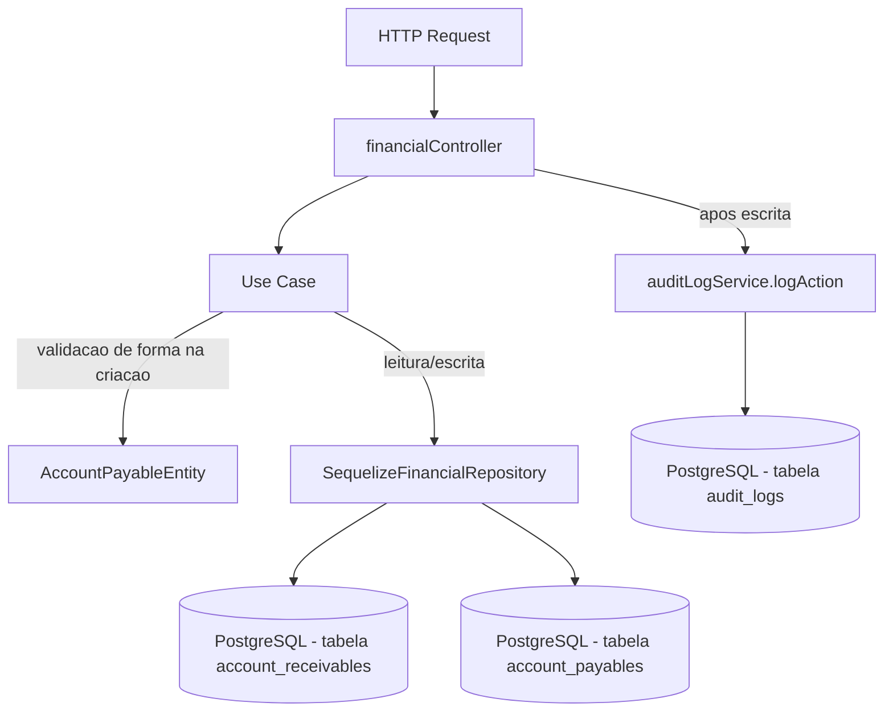

# Módulo Financial

## Objetivo

Gerenciar o financeiro básico da fábrica: contas a receber (geradas a
partir de vendas), contas a pagar (avulsas ou geradas na aprovação de
pedidos de compra pelo módulo `purchases`) e um relatório simples de fluxo
de caixa agregado por status em um período. Migrado para a arquitetura em
camadas (`domain` / `application` / `infrastructure` / `presentation`)
descrita na Fase 5/6 do `TODO.md`, seguindo o mesmo padrão dos módulos
`purchases`, `sales` e `production`.

Este módulo **não reimplementa** a geração automática de `AccountReceivable`
na criação de vendas nem de `AccountPayable` na aprovação de pedidos de
compra — isso continua fora do seu escopo, em `sales`/`purchases`. O
módulo `financial` cuida apenas da listagem, do registro de
recebimento/pagamento e do relatório de fluxo de caixa desses registros já
existentes, além da criação manual de contas a pagar avulsas.

## Decisão de compatibilidade de rotas

O endpoint `/api/finance` (mesmos 6 paths, métodos, middlewares e formato
de resposta JSON do controller anterior) agora é servido pelas
rotas/controller deste módulo (`presentation/routes/finance.ts` →
`presentation/controllers/financialController.ts`), registrado em
`server/index.ts`.

O arquivo anterior `server/src/routes/finance.ts` e o controller
`server/src/controllers/financeController.ts` **permanecem no
repositório** como referência histórica, mas **não são mais montados em
nenhuma rota** — evitando duplicidade de `/api/finance` e o risco de duas
implementações divergentes atenderem à mesma URL. Confirmado via `grep`
que apenas `server/index.ts` monta o módulo novo (uma única ocorrência de
`app.use('/api/finance', ...)`). Os arquivos anteriors podem ser removidos
em uma limpeza futura, uma vez confirmada a estabilidade da migração.

O middleware `authorize('admin', 'financial')` em `POST /api/finance/payable`
foi preservado exatamente, na mesma posição da cadeia de middlewares
(`authenticate` seguido de `authorize`).

Nenhum client precisa mudar: mesmos 6 endpoints, mesmos verbos HTTP, mesmo
envelope `{ success, data }` / `{ success, error }` (respostas de sucesso),
e o mesmo `statusCode` HTTP em todos os casos de erro do anterior (400,
404). Diferentemente de outros módulos migrados nesta iniciativa
(`purchases`/`sales`/`production`), aqui `statusCode` foi preservado
estritamente 1:1 — inclusive o caso "conta já paga/cancelada", que
permanece `400` (via `ValidationError`) em vez de `422`
(`BusinessRuleError`), para atender ao requisito explícito de manter o
"MESMO contrato JSON" deste módulo sem exigir nenhum ajuste no frontend.
A única diferença de formato está no **corpo** das respostas de erro (mesmo
padrão já adotado nos módulos `purchases`/`sales`/`inventory`/`bom`/
`production`): erros de validação/regra de negócio agora são instâncias de
`AppError` (`server/src/errors`) e chegam ao cliente como
`{ success: false, error: { code, message } }` em vez do
`{ success: false, error: "mensagem em string" }` usado pelo controller
anterior. Erros inesperados (5xx) mantêm o fallback genérico do
`errorHandler`, igual ao anterior.

Mapeamento das mensagens de erro do anterior para os novos tipos de
`AppError` (mesma mensagem textual, `statusCode` preservado):

| Situação | anterior | Novo |
|---|---|---|
| Conta (a receber/pagar) não encontrada | `404` string | `NotFoundError` (404) |
| Conta já paga / cancelada | `400` string | `ValidationError` (400) |
| Valor de pagamento inválido (`<= 0` ou excede o saldo) | `400` string | `ValidationError` (400) |
| Descrição/valor/vencimento ausentes ou valor inválido na criação de conta a pagar | `400` string | `ValidationError` (400) |

## Estrutura

```
server/src/modules/financial/
  domain/
    entities/AccountPayableEntity.ts           Validação de forma na criação de conta a pagar
    repositories/FinancialRepository.ts        Interface do repositório
  application/
    use-cases/
      ListReceivablesUseCase.ts
      ReceivePaymentUseCase.ts
      ListPayablesUseCase.ts
      CreatePayableUseCase.ts
      PayPayableUseCase.ts
      GetCashFlowUseCase.ts
  infrastructure/
    sequelize/SequelizeFinancialRepository.ts  Implementação usando os models existentes
  presentation/
    controllers/financialController.ts
    routes/finance.ts
```

## Modelos de dados utilizados

- `server/src/models/AccountReceivable.ts` (Sequelize, reutilizado — nenhum model novo foi criado).
- `server/src/models/AccountPayable.ts`.
- `server/src/models/Client.ts` (include em `AccountReceivable`, apenas leitura).
- `server/src/models/Sale.ts` (include em `AccountReceivable`, apenas leitura).
- `server/src/models/Supplier.ts` (referenciado por `supplier_id` na criação de conta a pagar; não incluído nas queries deste módulo, igual ao anterior).

## Regras de negócio

- **Listagem** (`listReceivable`/`listPayable`): filtros opcionais por `status`, intervalo de `due_date` (`start_date`/`end_date`) e, apenas em contas a receber, `customer_id`; paginação via `page`/`limit`.
- **Recebimento/Pagamento** (`receivePayment`/`payPayable`): a conta não pode estar `paid` nem `canceled`; se `amount` for informado, deve ser maior que zero e não pode exceder o valor atual da conta (permite baixa parcial, reduzindo o `amount` armazenado); `payment_date` default é a data atual; ao final, `status` vira `paid`.
- **Criação de conta a pagar** (`createPayable`): `description`, `amount` (> 0) e `due_date` são obrigatórios; sempre criada com `status: 'pending'`; `category`, `supplier_id`, `purchase_id` e `notes` são opcionais.
- **Fluxo de caixa** (`cashFlow`): agrega `AccountReceivable`/`AccountPayable` por `status` (`SUM(amount) GROUP BY status`) no intervalo informado (padrão: mês corrente); calcula `pending_receivable`, `pending_payable`, `total_receivable`, `total_payable`, `projected_balance` (pendentes) e `actual_balance` (totais).

## Endpoints

Base URL: `/api/finance` (autenticação obrigatória via middleware `authenticate` em todas as rotas).

| Método | Rota | Descrição | Middlewares extras |
|---|---|---|---|
| GET | `/api/finance/receivable` | Lista contas a receber (filtros: `status`, `customer_id`, `start_date`, `end_date`; paginação: `page`, `limit`) | — |
| PUT | `/api/finance/receivable/:id/pay` | Registra recebimento (total/parcial) de conta a receber | — |
| GET | `/api/finance/payable` | Lista contas a pagar (filtros: `status`, `start_date`, `end_date`; paginação: `page`, `limit`) | — |
| POST | `/api/finance/payable` | Cria conta a pagar avulsa | `authorize('admin', 'financial')` |
| PUT | `/api/finance/payable/:id/pay` | Registra pagamento (total/parcial) de conta a pagar | — |
| GET | `/api/finance/cash-flow` | Fluxo de caixa agregado por status, em um período | — |

Ver `docs/API.md` (seção 6 — Financeiro) para exemplos completos de request/response.

## Permissões

`GET`/`PUT` de contas a receber e a pagar exigem apenas JWT válido
(`authenticate`) — qualquer usuário autenticado pode registrar recebimentos
e pagamentos hoje. Apenas `POST /api/finance/payable` (criação manual de
conta a pagar) exige adicionalmente papel `admin` ou `financial`
(`authorize('admin', 'financial')`), preservado exatamente do anterior.
RBAC mais granular está listado como pendência na Fase 12 do `TODO.md`
("Revisar RBAC completo"), mesma pendência documentada nos demais módulos
migrados.

## Eventos / Auditoria

Todos os endpoints de escrita continuam chamando `logAction` (via
`server/src/services/auditLogService.ts`), preservando o comportamento do
controller anterior:

- `create` → `AccountPayable` criada.
- `status_change` → conta a receber ou a pagar marcada como `paid`.

`GET /receivable`, `GET /payable` e `GET /cash-flow` são somente leitura e
não geram auditoria, mesmo comportamento do anterior.

## Fluxo simplificado (Mermaid)



## Testes existentes

Nenhum teste automatizado existe hoje para este módulo (nem para o
restante do projeto — `server/tests/` ainda não existe). Cobertura de
testes unitários de `AccountPayableEntity`/use cases e testes de
integração dos endpoints está prevista na Fase 9 do `TODO.md`.

## Pendências conhecidas

- Não há RBAC granular por operação neste módulo além do já existente em
  `POST /api/finance/payable` (qualquer usuário autenticado pode registrar
  recebimentos/pagamentos).
- Validação de entrada é manual/via entidade (sem schema declarativo);
  migração para Zod está prevista para a Fase 8.
- `cashFlow` não gera série temporal diária (`daily_flow`); apenas
  agregados por status no período — mesmo comportamento do anterior. A
  documentação anterior em `docs/API.md` descrevia um formato de resposta
  (`daily_flow`) que nunca correspondeu à implementação real; foi
  corrigida nesta migração para refletir o comportamento efetivo, sem
  alterar código.
- O controller/rota anteriors (`server/src/controllers/financeController.ts`,
  `server/src/routes/finance.ts`) foram deixados intactos no repositório
  como referência histórica, mas não são mais usados; podem ser removidos
  em limpeza futura.
