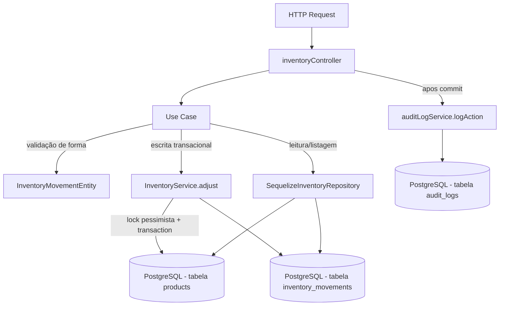
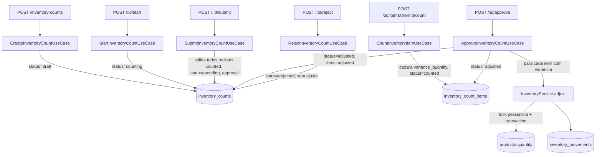

# Módulo Inventory

## Objetivo

Gerenciar as movimentações de estoque (entrada, saída, ajuste), os
relatórios de posição de estoque e o **inventário cíclico** (contagem
física periódica com workflow de aprovação, Fase F09) dos produtos da
fábrica de alto-falantes. É o segundo módulo migrado para a arquitetura em
camadas (`domain` / `application` / `infrastructure` / `presentation`)
descrita na Fase 5 do `TODO.md`, seguindo o mesmo padrão do módulo
`products`.

Este módulo **não reimplementa** a lógica transacional de alteração de
`Product.quantity` (lock pessimista, transação, validação de estoque
disponível) — essa lógica continua 100% centralizada em
`server/src/services/inventoryService.ts` (`InventoryService`), criado na
Fase 4.1. Os use cases deste módulo são wrappers finos que chamam
`InventoryService` dentro de uma transação criada pelo controller.

## Decisão de compatibilidade de rotas

O endpoint `/api/inventory` (mesmos paths, métodos e formato de resposta
JSON dos 4 endpoints existentes) agora é servido pelas rotas/controller
deste módulo (`presentation/routes/inventory.ts` →
`presentation/controllers/inventoryController.ts`), registrado em
`server/index.ts`.

O arquivo anterior `server/src/routes/inventory.ts` e o controller
`server/src/controllers/inventoryController.ts` **permanecem no
repositório** como referência histórica, mas **não são mais montados em
nenhuma rota** — evitando duplicidade de `/api/inventory` e o risco de duas
implementações divergentes atenderem à mesma URL. Eles podem ser removidos
em uma limpeza futura, uma vez confirmada a estabilidade da migração.

Nenhum client precisa mudar: mesmos paths, mesmos verbos HTTP, mesmo
envelope `{ success, data }` / `{ success, error }`. Erros lançados por
`InventoryService` (objetos `Error` simples com `statusCode`, não
`AppError`) continuam retornando `{ success: false, error: "mensagem" }`
igual ao controller anterior — o controller do módulo detecta esse formato
(`error.statusCode && !error.code`) e responde da mesma forma. Erros de
validação de forma lançados pela `InventoryMovementEntity` usam
`ValidationError` (`server/src/errors`) e chegam ao cliente como
`error: { code, message }`, seguindo o padrão já adotado desde a Fase 4.1.

Endpoint novo (aditivo, não quebra nada existente): `GET
/api/inventory/low-stock`.

## Estrutura

```
server/src/modules/inventory/
  domain/
    entities/InventoryMovementEntity.ts        Validação de forma da movimentação
    entities/InventoryCountEntity.ts           Novo (F09) — validação de forma da contagem de inventário
    repositories/InventoryRepository.ts        Interface do repositório de movimentações
    repositories/InventoryCountRepository.ts   Novo (F09) — interface do repositório de contagens
  application/
    use-cases/
      ListInventoryMovementsUseCase.ts
      GetInventoryMovementByIdUseCase.ts
      CreateInventoryMovementUseCase.ts        Wrapper fino sobre InventoryService.adjust
      GetStockReportUseCase.ts
      ListLowStockUseCase.ts
      CreateInventoryCountUseCase.ts           Novo (F09)
      StartInventoryCountUseCase.ts            Novo (F09)
      CountInventoryItemUseCase.ts             Novo (F09)
      SubmitInventoryCountUseCase.ts           Novo (F09)
      ApproveInventoryCountUseCase.ts          Novo (F09) — dispara InventoryService.adjust por item
      RejectInventoryCountUseCase.ts           Novo (F09)
      ListInventoryCountsUseCase.ts            Novo (F09)
      GetInventoryCountByIdUseCase.ts          Novo (F09)
  infrastructure/
    sequelize/SequelizeInventoryRepository.ts       Implementação usando os models InventoryMovement/Product existentes
    sequelize/SequelizeInventoryCountRepository.ts  Novo (F09) — usando os models InventoryCount/InventoryCountItem/Product
  presentation/
    controllers/inventoryController.ts
    controllers/inventoryCountController.ts    Novo (F09)
    routes/inventory.ts
    routes/inventoryCounts.ts                  Novo (F09) — montado em /api/inventory-counts
```

## Modelos de dados utilizados

- `server/src/models/InventoryMovement.ts` (Sequelize, reutilizado para movimentações).
- `server/src/models/InventoryCount.ts` / `InventoryCount.ts` — **novo (F09)**, cabeçalho da contagem de inventário cíclico.
- `server/src/models/InventoryCountItem.ts` / `InventoryCountItem.ts` — **novo (F09)**, item de contagem (produto, quantidade de sistema, quantidade contada, variância).
- `server/src/models/Product.ts` (leitura para relatório/estoque baixo e para fotografar `system_quantity` na contagem; escrita de `quantity` feita exclusivamente por `InventoryService`).
- `server/src/models/Category.ts` (associação `belongsTo`, apenas leitura).
- `server/src/models/User.ts` (associação `belongsTo` na movimentação e na contagem — `created_by`/`approved_by`/`counted_by`, apenas leitura).

As associações de `InventoryCount`/`InventoryCountItem` estão centralizadas em `server/src/models/index.ts` e `index.ts`, na seção `RELACIONAMENTOS - INVENTÁRIO CÍCLICO (F09)`.

## Regras de negócio

- `product_id`, `type` (`in`/`out`/`adjustment`) e `quantity` (> 0, numérica) são obrigatórios em toda movimentação — validado por `InventoryMovementEntity`.
- `reference_type`, quando informado, deve ser um de `sale`, `purchase`, `production`, `adjustment`, `transfer`.
- Saída (`out`) exige estoque disponível suficiente; validado dentro da mesma transação com lock pessimista (`SELECT ... FOR UPDATE`) por `InventoryService.adjust` — nunca no controller/use case.
- `adjustment` e `in` são tratados como entrada de estoque (soma); apenas `out` reduz `quantity`. Essa regra é 100% do `InventoryService`, não duplicada aqui.
- Todo movimento gera um registro `InventoryMovement` na mesma transação da alteração de `Product.quantity` (garantia de atomicidade).
- Produto é considerado "estoque baixo" quando `quantity <= min_quantity` (mesma regra usada em `summary.low_stock_count` do relatório e no novo endpoint `GET /low-stock`).

## Endpoints

Base URL: `/api/inventory` (autenticação obrigatória via middleware `authenticate` em todas as rotas).

| Método | Rota | Descrição |
|---|---|---|
| GET | `/api/inventory/movements` | Lista movimentações (filtros: `product_id`, `type`, `start_date`, `end_date`; paginação: `page`, `limit`) |
| GET | `/api/inventory/movements/:id` | Busca movimentação por id |
| POST | `/api/inventory/movements` | Registra movimentação (entrada/saída/ajuste) — transacional, lock pessimista via `InventoryService` |
| GET | `/api/inventory/stock-report` | Relatório consolidado de estoque (resumo + produtos ativos) |
| GET | `/api/inventory/low-stock` | Lista produtos ativos com `quantity <= min_quantity` |

Ver `docs/API.md` para exemplos completos de request/response. Os endpoints de
**Inventário Cíclico (F09)**, sob o prefixo `/api/inventory-counts`, estão
documentados na seção dedicada abaixo.

## Permissões

Todas as rotas exigem JWT válido (`authenticate`). O projeto ainda não
possui um middleware de RBAC granular por rota neste módulo — qualquer
usuário autenticado pode registrar movimentações de estoque hoje. Isso está
listado como pendência na Fase 12 do `TODO.md` ("Revisar RBAC completo").

## Eventos / Auditoria

`POST /api/inventory/movements` continua chamando `logAction` (via
`server/src/services/auditLogService.ts`) após o `commit` da transação
(para não segurar locks de banco durante a escrita do log), preservando o
comportamento do controller anterior:

- `create` (type `in`/`adjustment`) ou `update` (type `out`) → entidade
  `InventoryMovement`, com `oldValues`/`newValues` de quantidade movimentada.

Os demais endpoints (`list`, `getById`, `getStockReport`, `listLowStock`)
são somente leitura e não geram auditoria, mesmo comportamento do anterior.

## Testes existentes

Nenhum teste automatizado existe hoje para este módulo (nem para o
restante do projeto — `server/tests/` ainda não existe). Cobertura de
testes unitários de `InventoryMovementEntity`/use cases e testes de
integração dos endpoints está prevista na Fase 9 do `TODO.md`.

## Fluxo simplificado (Mermaid)



## Inventário Cíclico (F09)

### Papel na fábrica

Contagem física periódica do estoque (cíclica por classe/produto, geral ou
pontual) para detectar precocemente divergências entre o estoque contábil
(`Product.quantity`) e o estoque físico real, com workflow de aprovação
antes de qualquer ajuste ser aplicado ao sistema. Endereça o gap **F09**
identificado em
`docs/analises/03-ANALISE_QUARTA_RODADA_FALHAS_MELHORIAS.md`.

### Workflow de status

`InventoryCount.status`:

```
draft --(start)--> counting --(submit)--> pending_approval --(approve)--> adjusted
                                                 |
                                                 +--(reject)--> rejected
```

- **draft** — contagem criada, ainda não iniciada. Pode já ter itens (se `product_ids` foi informado na criação).
- **counting** — contagem em andamento; itens podem ser contados via `POST .../items/:itemId/count`.
- **pending_approval** — todos os itens foram contados e a contagem foi enviada para aprovação.
- **approved / adjusted** — aprovada; o use case `ApproveInventoryCountUseCase` aplica, na mesma transação, o ajuste de estoque de cada item com variância (via `InventoryService.adjust`) e marca a contagem final como `adjusted`. Não existe hoje uma parada intermediária persistida em `approved` sem ajuste — a aprovação e o ajuste ocorrem atomicamente na mesma chamada `POST /:id/approve`, refletindo o único endpoint de aprovação previsto nesta sprint.
- **rejected** — rejeitada; nenhum ajuste de estoque é aplicado.

`InventoryCountItem.status`: `pending` → `counted` (ao registrar `counted_quantity`) → `adjusted` (após aprovação da contagem, independentemente de ter variância ou não).

### Endpoints

Base URL: `/api/inventory-counts` (autenticação obrigatória via middleware `authenticate` em todas as rotas).

| Método | Rota | Descrição |
|---|---|---|
| POST | `/api/inventory-counts` | Cria uma contagem (`status = draft`); aceita `count_type`, `location`, `notes` e, opcionalmente, `product_ids` (já cria os itens fotografando `system_quantity`) |
| GET | `/api/inventory-counts` | Lista contagens (filtros: `status`, `count_type`; paginação: `page`, `limit`) |
| GET | `/api/inventory-counts/:id` | Busca uma contagem por id, com itens e produtos |
| POST | `/api/inventory-counts/:id/start` | Inicia a contagem (`draft` → `counting`) |
| POST | `/api/inventory-counts/:id/items/:itemId/count` | Registra a quantidade contada fisicamente de um item (`counted_quantity`), calcula `variance_quantity` e marca o item como `counted` |
| POST | `/api/inventory-counts/:id/submit` | Envia para aprovação (`counting` → `pending_approval`); exige que todos os itens estejam `counted` |
| POST | `/api/inventory-counts/:id/approve` | Aprova a contagem (`pending_approval` → `adjusted`), aplicando `InventoryService.adjust` para cada item com variância |
| POST | `/api/inventory-counts/:id/reject` | Rejeita a contagem (`pending_approval` → `rejected`), aceita `reason` opcional |

Envelope de resposta padrão do projeto: `{ success: true, data }` /
`{ success: false, error }` (erros de `InventoryService.adjust`, que usa
`Error` simples com `statusCode`) ou `{ success: false, error: { code,
message } }` (erros `AppError`/`ValidationError`/`NotFoundError`/
`BusinessRuleError` lançados pelas entidades e use cases deste submódulo).

### Uso de `InventoryService.adjust`

`ApproveInventoryCountUseCase` é o único ponto do submódulo que altera
`Product.quantity`, e faz isso **exclusivamente** chamando
`InventoryService.adjust(productId, type, quantity, userId, reason,
transaction)` (assinatura atual de `server/src/services/inventoryService.ts`)
para cada item cuja `variance_quantity` seja diferente de zero:

- `type = 'in'` quando `variance_quantity > 0` (contagem física maior que o sistema).
- `type = 'out'` quando `variance_quantity < 0` (contagem física menor que o sistema).
- `quantity = Math.abs(variance_quantity)`.
- `reason` inclui o número da contagem e o id do item, para rastreabilidade no `InventoryMovement` gerado.

Todo o laço de ajustes roda em uma única transação Sequelize
(`sequelize.transaction()`), junto com a atualização de status dos itens e
do cabeçalho da contagem — se qualquer ajuste falhar (ex.: produto não
encontrado, saída maior que o disponível), a transação inteira é revertida
e a contagem permanece em `pending_approval`. Nenhum código deste submódulo
faz `Product.update({ quantity: ... })` diretamente.

### Modelos de dados (F09)

- `server/src/models/InventoryCount.ts` / `.ts` — cabeçalho (`count_number`, `status`, `count_type`, `location`, `started_at`, `completed_at`, `approved_at`, `created_by`, `approved_by`, `notes`).
- `server/src/models/InventoryCountItem.ts` / `.ts` — item (`inventory_count_id`, `product_id`, `system_quantity`, `counted_quantity`, `variance_quantity`, `status`, `counted_by`, `counted_at`, `notes`).

### Fluxo simplificado (Mermaid)



### Migrations (F09)

Nenhuma migration formal foi criada nesta sprint. As tabelas
`inventory_counts` e `inventory_count_items` são criadas/atualizadas por
`sequelize.sync({ alter: true })` (`server/config/db.ts`), seguindo o mesmo
padrão híbrido usado por todos os demais models do projeto até a Fase 11.
**Migrations formais (com `up`/`down` versionados) ficam pendentes para a
Fase 11 do `TODO.md`** ("Banco de dados, migrations e producao"), quando
todo o schema atual deverá ser migrado para migrations reais.

### Pendências conhecidas (F09)

- Classificação ABC e periodicidade automática de recontagem (ex.: itens
  classe A toda semana, B a cada 15 dias, C a cada mês) mencionadas na
  análise original do gap F09 **não foram implementadas** — o módulo cobre
  o workflow manual de criação/contagem/aprovação, não a geração automática
  de contagens agendadas.
- Não há endpoint para adicionar itens a uma contagem já existente após a
  criação (`product_ids` só pode ser informado em `POST
  /inventory-counts`); para adicionar produtos depois, hoje é preciso criar
  uma nova contagem.
- Não há RBAC granular por papel (ex.: exigir um perfil "supervisor" para
  aprovar) — qualquer usuário autenticado pode chamar `POST
  /:id/approve`/`reject`, mesma limitação já documentada para o restante do
  módulo `inventory`.
- Testes automatizados não foram criados (mesma pendência geral do projeto,
  Fase 9 do `TODO.md`).

## Pendências conhecidas

- **`reserved_quantity` não existe no schema do `Product`** (dívida técnica
  documentada na Prioridade 5 do `TODO.md`, seção "Sistema de Reserva de
  Estoque (F22)"). Consequentemente, os use cases `ReserveStockUseCase` /
  `ReleaseStockReservationUseCase` / `TransferStockUseCase` previstos na
  Fase 6 do `TODO.md` **não foram criados** nesta migração — o
  `InventoryService.reserve`/`releaseReservation` já existentes são
  "no-op defensivo" (validam entrada e disponibilidade, mas não persistem
  reserva nenhuma) até a coluna ser adicionada ao schema. Quando essa
  coluna existir, criar os use cases `ReserveStockUseCase`,
  `ReleaseStockReservationUseCase` e `TransferStockUseCase` neste módulo,
  reutilizando os métodos correspondentes de `InventoryService`.
- `ConsumeStockUseCase`/`ReceiveStockUseCase` (Fase 6) também não foram
  criados como use cases HTTP dedicados porque não há endpoints
  específicos para eles hoje (`consume`/`receive` do `InventoryService` são
  usados internamente por outros módulos como vendas/compras/produção, não
  expostos diretamente aqui). `CreateInventoryMovementUseCase` cobre o
  único endpoint manual existente (`POST /movements`), que já delega a
  `InventoryService.adjust` (que por sua vez chama `consume`/`increment`
  conforme o tipo).
- `AdjustStockUseCase` da Fase 6 corresponde, na prática, a
  `CreateInventoryMovementUseCase` deste módulo (mesma operação, nome
  adaptado ao endpoint anterior já existente `POST /movements`).
- Não há RBAC granular por papel neste módulo (qualquer usuário autenticado
  pode registrar movimentações de estoque).
- Validação de entrada é manual/via entidade (sem schema declarativo);
  migração para Zod está prevista para a Fase 8.
- O controller/rota anteriors (`server/src/controllers/inventoryController.ts`,
  `server/src/routes/inventory.ts`) foram deixados intactos no repositório
  como referência histórica, mas não são mais usados; podem ser removidos
  em limpeza futura.
