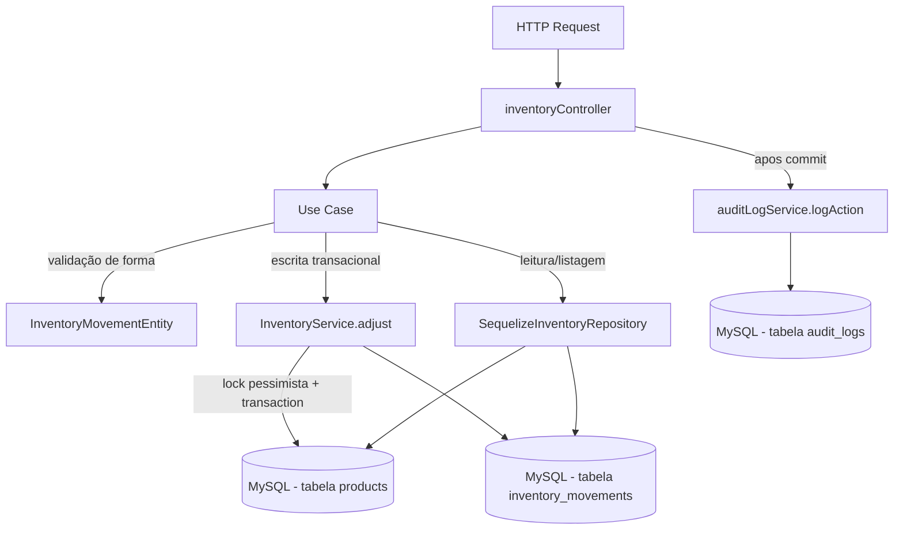

# Módulo Inventory

## Objetivo

Gerenciar as movimentações de estoque (entrada, saída, ajuste) e os
relatórios de posição de estoque dos produtos da fábrica de alto-falantes.
É o segundo módulo migrado para a arquitetura em camadas (`domain` /
`application` / `infrastructure` / `presentation`) descrita na Fase 5 do
`TODO.md`, seguindo o mesmo padrão do módulo `products`.

Este módulo **não reimplementa** a lógica transacional de alteração de
`Product.quantity` (lock pessimista, transação, validação de estoque
disponível) — essa lógica continua 100% centralizada em
`server/src/services/inventoryService.js` (`InventoryService`), criado na
Fase 4.1. Os use cases deste módulo são wrappers finos que chamam
`InventoryService` dentro de uma transação criada pelo controller.

## Decisão de compatibilidade de rotas

O endpoint `/api/inventory` (mesmos paths, métodos e formato de resposta
JSON dos 4 endpoints existentes) agora é servido pelas rotas/controller
deste módulo (`presentation/routes/inventory.js` →
`presentation/controllers/inventoryController.js`), registrado em
`server/index.js`.

O arquivo legado `server/src/routes/inventory.js` e o controller
`server/src/controllers/inventoryController.js` **permanecem no
repositório** como referência histórica, mas **não são mais montados em
nenhuma rota** — evitando duplicidade de `/api/inventory` e o risco de duas
implementações divergentes atenderem à mesma URL. Eles podem ser removidos
em uma limpeza futura, uma vez confirmada a estabilidade da migração.

Nenhum client precisa mudar: mesmos paths, mesmos verbos HTTP, mesmo
envelope `{ success, data }` / `{ success, error }`. Erros lançados por
`InventoryService` (objetos `Error` simples com `statusCode`, não
`AppError`) continuam retornando `{ success: false, error: "mensagem" }`
igual ao controller legado — o controller do módulo detecta esse formato
(`error.statusCode && !error.code`) e responde da mesma forma. Erros de
validação de forma lançados pela `InventoryMovementEntity` usam
`ValidationError` (`server/src/errors`) e chegam ao cliente como
`error: { code, message }`, seguindo o padrão já adotado desde a Fase 4.1.

Endpoint novo (aditivo, não quebra nada existente): `GET
/api/inventory/low-stock`.

## Estrutura

```
server/src/modules/inventory/
  domain/
    entities/InventoryMovementEntity.js      Validação de forma da movimentação
    repositories/InventoryRepository.js      Interface do repositório
  application/
    use-cases/
      ListInventoryMovementsUseCase.js
      GetInventoryMovementByIdUseCase.js
      CreateInventoryMovementUseCase.js      Wrapper fino sobre InventoryService.adjust
      GetStockReportUseCase.js
      ListLowStockUseCase.js                 Novo
  infrastructure/
    sequelize/SequelizeInventoryRepository.js  Implementação usando os models InventoryMovement/Product existentes
  presentation/
    controllers/inventoryController.js
    routes/inventory.js
```

## Modelos de dados utilizados

- `server/src/models/InventoryMovement.js` (Sequelize, reutilizado — nenhum model novo foi criado).
- `server/src/models/Product.js` (leitura para relatório/estoque baixo; escrita de `quantity` feita exclusivamente por `InventoryService`).
- `server/src/models/Category.js` (associação `belongsTo`, apenas leitura).
- `server/src/models/User.js` (associação `belongsTo` na movimentação, apenas leitura).

## Regras de negócio

- `product_id`, `type` (`in`/`out`/`adjustment`) e `quantity` (> 0, numérica) são obrigatórios em toda movimentação — validado por `InventoryMovementEntity`.
- `reference_type`, quando informado, deve ser um de `sale`, `purchase`, `production`, `adjustment`, `transfer`.
- Saída (`out`) exige estoque disponível suficiente; validado dentro da mesma transação com lock pessimista (`SELECT ... FOR UPDATE`) por `InventoryService.adjust` — nunca no controller/use case.
- `adjustment` e `in` são tratados como entrada de estoque (soma); apenas `out` reduz `quantity`. Essa regra é 100% do `InventoryService`, não duplicada aqui.
- Todo movimento gera um registro `InventoryMovement` na mesma transação da alteração de `Product.quantity` (garantia de atomicidade).
- Produto é considerado "estoque baixo" quando `quantity <= min_quantity` (mesma regra usada em `summary.low_stock_count` do relatório e no novo endpoint `GET /low-stock`).

## Endpoints

Base URL: `/api/inventory` (autenticação obrigatória via middleware `authenticate` em todas as rotas).

| Método | Rota | Descrição |
|---|---|---|
| GET | `/api/inventory/movements` | Lista movimentações (filtros: `product_id`, `type`, `start_date`, `end_date`; paginação: `page`, `limit`) |
| GET | `/api/inventory/movements/:id` | Busca movimentação por id |
| POST | `/api/inventory/movements` | Registra movimentação (entrada/saída/ajuste) — transacional, lock pessimista via `InventoryService` |
| GET | `/api/inventory/stock-report` | Relatório consolidado de estoque (resumo + produtos ativos) |
| GET | `/api/inventory/low-stock` | **Novo.** Lista produtos ativos com `quantity <= min_quantity` |

Ver `docs/API.md` para exemplos completos de request/response.

## Permissões

Todas as rotas exigem JWT válido (`authenticate`). O projeto ainda não
possui um middleware de RBAC granular por rota neste módulo — qualquer
usuário autenticado pode registrar movimentações de estoque hoje. Isso está
listado como pendência na Fase 12 do `TODO.md` ("Revisar RBAC completo").

## Eventos / Auditoria

`POST /api/inventory/movements` continua chamando `logAction` (via
`server/src/services/auditLogService.js`) após o `commit` da transação
(para não segurar locks de banco durante a escrita do log), preservando o
comportamento do controller legado:

- `create` (type `in`/`adjustment`) ou `update` (type `out`) → entidade
  `InventoryMovement`, com `oldValues`/`newValues` de quantidade movimentada.

Os demais endpoints (`list`, `getById`, `getStockReport`, `listLowStock`)
são somente leitura e não geram auditoria, mesmo comportamento do legado.

## Testes existentes

Nenhum teste automatizado existe hoje para este módulo (nem para o
restante do projeto — `server/tests/` ainda não existe). Cobertura de
testes unitários de `InventoryMovementEntity`/use cases e testes de
integração dos endpoints está prevista na Fase 9 do `TODO.md`.

## Fluxo simplificado (Mermaid)



## Pendências conhecidas

- **`reserved_quantity` não existe no schema do `Product`** (dívida técnica
  documentada na Prioridade 5 do `TODO.md`, seção "Sistema de Reserva de
  Estoque (F22)"). Consequentemente, os use cases `ReserveStockUseCase` /
  `ReleaseStockReservationUseCase` / `TransferStockUseCase` previstos na
  Fase 6 do `TODO.md` **não foram criados** nesta migração — o
  `InventoryService.reserve`/`releaseReservation` já existentes são
  "no-op defensivo" (validam entrada e disponibilidade, mas não persistem
  reserva nenhuma) até a coluna ser adicionada ao schema. Quando essa
  coluna existir, criar os use cases `ReserveStockUseCase`,
  `ReleaseStockReservationUseCase` e `TransferStockUseCase` neste módulo,
  reutilizando os métodos correspondentes de `InventoryService`.
- `ConsumeStockUseCase`/`ReceiveStockUseCase` (Fase 6) também não foram
  criados como use cases HTTP dedicados porque não há endpoints
  específicos para eles hoje (`consume`/`receive` do `InventoryService` são
  usados internamente por outros módulos como vendas/compras/produção, não
  expostos diretamente aqui). `CreateInventoryMovementUseCase` cobre o
  único endpoint manual existente (`POST /movements`), que já delega a
  `InventoryService.adjust` (que por sua vez chama `consume`/`increment`
  conforme o tipo).
- `AdjustStockUseCase` da Fase 6 corresponde, na prática, a
  `CreateInventoryMovementUseCase` deste módulo (mesma operação, nome
  adaptado ao endpoint legado já existente `POST /movements`).
- Não há RBAC granular por papel neste módulo (qualquer usuário autenticado
  pode registrar movimentações de estoque).
- Validação de entrada é manual/via entidade (sem schema declarativo);
  migração para Zod está prevista para a Fase 8.
- O controller/rota legados (`server/src/controllers/inventoryController.js`,
  `server/src/routes/inventory.js`) foram deixados intactos no repositório
  como referência histórica, mas não são mais usados; podem ser removidos
  em limpeza futura.
