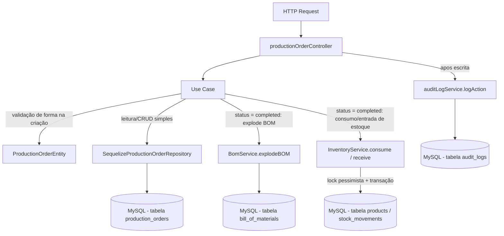
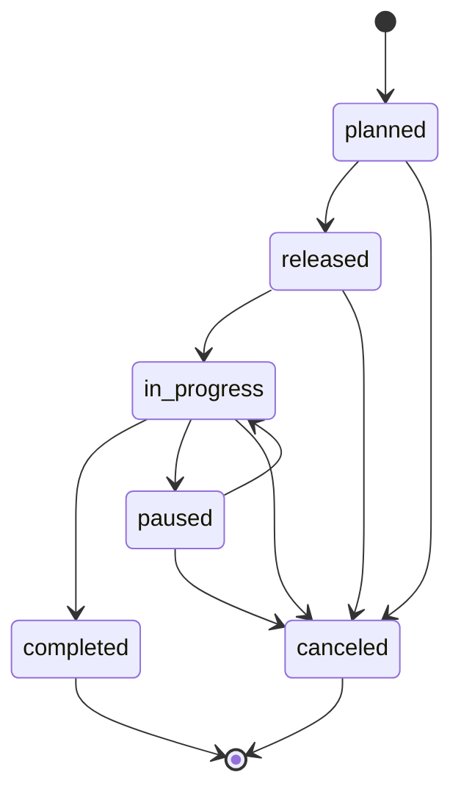

# Módulo Production (Ordem de Produção — OP)

## Objetivo

Gerenciar o ciclo de vida da Ordem de Produção (OP) da fábrica de
alto-falantes: planejamento (quantidade, data de vencimento, prioridade,
responsável), liberação/execução (máquina de estados
`planned → released → in_progress → completed/paused/canceled`), e o
efeito colateral mais crítico do PCP — ao concluir uma OP, consumir os
componentes da BOM ativa do produto e dar entrada do produto acabado no
estoque, tudo em uma única transação com lock pessimista.

É o quarto módulo migrado para a arquitetura em camadas (`domain` /
`application` / `infrastructure` / `presentation`) descrita nas Fases 5/6
do `TODO.md`, seguindo o mesmo padrão dos módulos `products`, `inventory` e
`bom`.

Este módulo **não reimplementa** a lógica de consumo/entrada de estoque
(lock pessimista + transação, corrigidos na Fase 4.1) nem a explosão de
BOM — ambas continuam 100% centralizadas em
`server/src/services/inventoryService.js` (`InventoryService.consume`/
`InventoryService.receive`) e `server/src/services/bomService.js`
(`BomService.explodeBOM`). Os use cases deste módulo orquestram essas
chamadas dentro da mesma transação Sequelize que já existia no controller
legado.

## Decisão de compatibilidade de rotas

O endpoint `/api/production-orders` (mesmos 7 paths, métodos, middlewares
de `authorize` e formato de resposta JSON do controller legado) agora é
servido pelas rotas/controller deste módulo
(`presentation/routes/productionOrders.js` →
`presentation/controllers/productionOrderController.js`), registrado em
`server/index.js`.

Os arquivos legados `server/src/routes/productionOrders.js` e
`server/src/controllers/productionOrderController.js` **permanecem no
repositório** como referência histórica, mas **não são mais montados em
nenhuma rota** — evitando duplicidade de `/api/production-orders` e o risco
de duas implementações divergentes atenderem à mesma URL. Podem ser
removidos em uma limpeza futura, uma vez confirmada a estabilidade da
migração.

Nenhum client precisa mudar: mesmos paths, mesmos verbos HTTP, mesmos
middlewares (`authorize('admin', 'operator')` em `POST /`,
`authorize('admin')` em `DELETE /:id`), mesmo envelope `{ success, data }` /
`{ success, error }`. Erros lançados pelos use cases usam `ValidationError`,
`NotFoundError`, `BusinessRuleError` e `ConflictError`
(`server/src/errors`), todas subclasses de `AppError` com `statusCode`
próprio; o controller do módulo responde `{ success: false, error: message
}` no mesmo formato do controller legado (que usava `res.status(...).json(...)`
diretamente), preservando os mesmos códigos HTTP (400/404/409/422) para
cada situação de erro.

## Decisão de desenho: um único `ChangeProductionOrderStatusUseCase`

O `TODO.md` (Fase 6) prevê use cases separados por transição
(`ReleaseProductionOrderUseCase`, `StartProductionOrderUseCase`,
`PauseProductionOrderUseCase`, `ResumeProductionOrderUseCase`,
`CompleteProductionOrderUseCase`, `CancelProductionOrderUseCase`), mas o
controller legado sempre teve um **único** método `updateStatus`, dirigido
por uma tabela `validTransitions` (máquina de estados), atendendo a um
único endpoint `PUT /api/production-orders/:id/status` que recebe o status
alvo no corpo da requisição.

Criar 6 classes separadas exigiria replicar a mesma tabela
`VALID_TRANSITIONS` (ou uma fatia dela) em cada uma, ou fazê-las delegar
umas às outras de forma artificial — nenhuma das duas opções é mais legível
ou mais segura do que ter a máquina de estados em um único lugar. Optou-se
por **`ChangeProductionOrderStatusUseCase`**, que:

- recebe `{ id, status, quantity_produced, user_id }`;
- valida a transição usando a mesma tabela `VALID_TRANSITIONS` (único ponto
  de verdade, exportada como propriedade estática da classe para eventual
  reuso/teste);
- ao receber `status === 'completed'`, delega para o método privado
  `_completeOrder`, que cobre exatamente o papel do
  `RegisterProductionOutputUseCase` previsto no TODO (registra
  `quantity_produced`, consome componentes via BOM, dá entrada do produto
  acabado) — é isso que o controller legado já fazia inline dentro do
  mesmo método `updateStatus`.

Essa é uma decisão de Clean Code: evitar duplicação da máquina de estados
em seis classes é mais alinhado ao princípio DRY do que criar seis use
cases finos que, na prática, só mudam uma string (`status`) e reexecutam a
mesma validação de transição. O nome do endpoint HTTP e o formato de
entrada/saída permanecem idênticos ao legado.

### `RegisterScrapUseCase` — não implementado (pendência de schema)

O `TODO.md` lista `RegisterScrapUseCase` como use case esperado da Fase 6.
**Não foi implementado nesta migração** porque não existe hoje nenhum
campo de refugo/scrap (`quantity_scrapped` ou similar) no model
`ProductionOrder` (`server/src/models/ProductionOrder.js`), nem qualquer
endpoint ou lógica de registro de refugo no controller legado. Implementar
esse use case agora exigiria inventar uma funcionalidade nova (schema +
regra de negócio) fora do escopo desta tarefa de migração 1:1.

**Pendência registrada para fase futura:** adicionar o campo
`quantity_scrapped` (INTEGER, default 0) ao model `ProductionOrder`, criar
`RegisterScrapUseCase` (validando `quantity_scrapped >= 0` e que a soma
`quantity_produced + quantity_scrapped` não ultrapasse `quantity`
planejada, dentro da mesma transação de conclusão) e o endpoint
correspondente (ex.: `POST /api/production-orders/:id/scrap` ou um campo
adicional no corpo de `PUT /:id/status`).

## Estrutura

```
server/src/modules/production/
  domain/
    entities/ProductionOrderEntity.js         Validação de forma na criação
    repositories/ProductionOrderRepository.js Interface do repositório
  application/
    use-cases/
      ListProductionOrdersUseCase.js
      GetProductionOrderByIdUseCase.js
      CreateProductionOrderUseCase.js
      UpdateProductionOrderUseCase.js
      ChangeProductionOrderStatusUseCase.js   Máquina de estados única (ver decisão acima)
      RemoveProductionOrderUseCase.js
      GetProductionReportUseCase.js
  infrastructure/
    sequelize/SequelizeProductionOrderRepository.js  Implementação usando os models ProductionOrder/Product/Employee/User existentes
  presentation/
    controllers/productionOrderController.js
    routes/productionOrders.js
```

## Modelos de dados utilizados

- `server/src/models/ProductionOrder.js` (Sequelize, reutilizado — nenhum model novo foi criado).
- `server/src/models/Product.js` (leitura: validação de produto `finished`/`active`; escrita de estoque feita via `InventoryService`).
- `server/src/models/Employee.js` (leitura: responsável pela OP).
- `server/src/models/User.js` (leitura: usuário criador).

## Regras de negócio

- `product_id`, `quantity > 0` e `due_date` são obrigatórios na criação — validado por `ProductionOrderEntity` (forma).
- O produto informado deve existir, estar `status === 'active'` e ser `product_type === 'finished'` — validado por `CreateProductionOrderUseCase` consultando `Product` (não duplicado na entidade).
- `order_number` é gerado automaticamente no formato `OP-<ano>-XXXX`, sequencial por ano — `CreateProductionOrderUseCase`.
- Alteração de campos gerais (`priority`, `due_date`, `responsible_id`, `notes`) via `PUT /:id` **não aceita** `status` no corpo — deve usar `PUT /:id/status` (`UpdateProductionOrderUseCase` rejeita com `ValidationError`).
- Máquina de estados (`ChangeProductionOrderStatusUseCase.VALID_TRANSITIONS`): `planned → released|canceled`; `released → in_progress|canceled`; `in_progress → completed|paused|canceled`; `paused → in_progress|canceled`; `completed`/`canceled` são estados finais (sem transições).
- Transição para `in_progress` registra `start_date = now()`.
- Transição para `completed` registra `quantity_produced` (padrão: quantidade planejada, se não informada), `completion_date = now()`, consome os componentes da BOM ativa do produto (via `BomService.explodeBOM` + `InventoryService.consume`, tolerando produto sem BOM cadastrada) e dá entrada do produto acabado no estoque (`InventoryService.receive`).
- A leitura da OP para transição usa lock pessimista (`SELECT ... FOR UPDATE`) dentro da transação, evitando que duas requisições concorrentes de mudança de status processem a mesma OP duas vezes (ex.: duplo clique em "concluir" duplicando entrada de estoque) — comportamento herdado da correção da Fase 4.1, preservado integralmente.
- OPs em `in_progress` ou `completed` não podem ser removidas — `RemoveProductionOrderUseCase` (`BusinessRuleError`, HTTP 422).

## Endpoints

Base URL: `/api/production-orders` (autenticação obrigatória via middleware `authenticate` em todas as rotas).

| Método | Rota | Autorização | Descrição |
|---|---|---|---|
| GET | `/api/production-orders` | qualquer usuário autenticado | Lista OPs (filtros: `status`, `product_id`, `priority`, `start_date`, `end_date`; paginação: `page`, `limit`) + `summary` (total, planned, in_progress, completed, overdue) |
| GET | `/api/production-orders/report` | qualquer usuário autenticado | Relatório de produção de um período (`start_date`, `end_date`) |
| GET | `/api/production-orders/:id` | qualquer usuário autenticado | Detalhes da OP |
| POST | `/api/production-orders` | `admin`, `operator` | Cria OP |
| PUT | `/api/production-orders/:id` | qualquer usuário autenticado | Atualiza campos gerais (não-status) |
| PUT | `/api/production-orders/:id/status` | qualquer usuário autenticado | Muda status (máquina de estados; consome BOM e dá entrada em estoque quando `status === 'completed'`) |
| DELETE | `/api/production-orders/:id` | `admin` | Remove a OP (apenas se não estiver `in_progress`/`completed`) |

Ver `docs/API.md` para exemplos completos de request/response.

## Permissões

`authenticate` (JWT) obrigatório em todas as rotas. `authorize('admin', 'operator')`
em `POST /` e `authorize('admin')` em `DELETE /:id`, preservados exatamente
como no roteador legado. As demais rotas (`GET`, `PUT`) não têm restrição
de papel adicional hoje — mesmo comportamento do legado; revisão de RBAC
granular está prevista na Fase 12 do `TODO.md`.

## Eventos / Auditoria

Os endpoints de escrita continuam chamando `logAction` (via
`server/src/services/auditLogService.js`), preservando o comportamento do
controller legado:

- `POST /` → `action: 'create'`, entidade `ProductionOrder`, com `product_id`, `quantity` e `status: 'planned'`.
- `PUT /:id` → `action: 'update'`, com `oldValues`/`newValues` apenas dos campos efetivamente alterados.
- `PUT /:id/status` → `action: 'status_change'`, com `oldValues: { status: <status anterior> }` e `newValues: { status, quantity_produced? }`.
- `DELETE /:id` → `action: 'delete'`, com `oldValues: { status: <status anterior> }`.

Em todos os casos, o log é registrado **após o commit** da transação, para
não segurar locks de banco (mesmo comentário/comportamento do legado).

## Testes existentes

Nenhum teste automatizado existe hoje para este módulo (nem para o
restante do projeto — `server/tests/` ainda não existe). Cobertura de
testes unitários de `ProductionOrderEntity`/use cases e testes de
integração dos endpoints está prevista na Fase 9 do `TODO.md`.

## Fluxo simplificado (Mermaid)



## Diagrama de estados da OP



## Pendências conhecidas

- `RegisterScrapUseCase` não foi implementado — não há campo de refugo no
  model `ProductionOrder` hoje. Ver decisão detalhada acima.
- Não há RBAC granular por papel nas rotas `GET`/`PUT` (apenas `POST`/`DELETE`
  restringem por papel, herdado do legado).
- Validação de entrada é manual/via entidade (sem schema declarativo);
  migração para Zod está prevista para a Fase 8.
- O controller/rota legados (`server/src/controllers/productionOrderController.js`,
  `server/src/routes/productionOrders.js`) foram deixados intactos no
  repositório como referência histórica, mas não são mais usados; podem ser
  removidos em limpeza futura.
