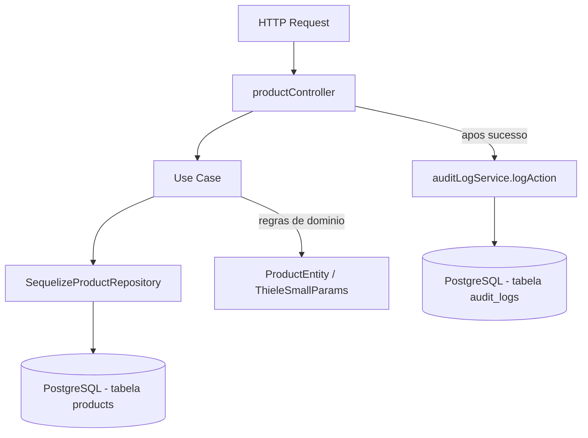

# Módulo Products

## Objetivo

Gerenciar o catálogo de produtos da fábrica de alto-falantes: produtos
acabados, semi-acabados, componentes e matérias-primas — incluindo dados
fiscais (NCM/CEST), dados técnicos (desenho, revisão) e parâmetros
acústicos Thiele-Small usados em engenharia/PCP.

Este módulo é o primeiro migrado para a arquitetura em camadas
(`domain` / `application` / `infrastructure` / `presentation`) descrita na
Fase 5 do `TODO.md`, servindo de referência para a migração dos módulos
seguintes (`inventory`, `bom`, `production`, `purchases`, `sales`).

## Decisão de compatibilidade de rotas

O endpoint `/api/products` (mesmo path, mesmos métodos, mesmo formato de
resposta JSON) agora é servido pelas rotas/controller deste módulo
(`presentation/routes/products.ts` → `presentation/controllers/productController.ts`),
registrado em `server/index.ts`.

Os arquivos anteriors `server/src/routes/products.ts` e
`server/src/controllers/productController.ts` **permanecem no repositório**
como referência histórica, mas **não são mais montados em nenhuma rota**
— evitando duplicidade de `/api/products` e o risco de duas
implementações divergentes atenderem à mesma URL. Eles podem ser removidos
em uma limpeza futura, uma vez confirmada a estabilidade da migração.

Nenhum client precisa mudar: mesmos paths, mesmos verbos HTTP, mesmo
envelope `{ success, data }` / `{ success, error }` para os fluxos de
sucesso e para os erros de validação de negócio tratados explicitamente no
controller (código duplicado, erro de negócio). A única diferença sutil é
que erros lançados via `ValidationError`/`NotFoundError`/`ConflictError`/
`BusinessRuleError` (classes de `server/src/errors`) chegam ao cliente como
`error: { code, message }` (formato já adotado pelo `errorHandler` global
desde a Fase 4.1), em vez de `error: "string"` como alguns branches do
controller anterior faziam manualmente. Isso já é o padrão vigente do
projeto para módulos que usam `AppError`, então não é uma regressão.

## Estrutura

```
server/src/modules/products/
  domain/
    entities/ProductEntity.ts            Regras de negócio do produto
    value-objects/ThieleSmallParams.ts   Parâmetros Thiele-Small (Fs, Qms, Qes, ...)
    repositories/ProductRepository.ts    Interface do repositório
  application/
    use-cases/
      ListProductsUseCase.ts
      GetProductByIdUseCase.ts
      CreateProductUseCase.ts
      UpdateProductUseCase.ts
      DeactivateProductUseCase.ts
      ChangeProductStatusUseCase.ts
      CreateProductRevisionUseCase.ts
      RegisterProductMovementUseCase.ts
  infrastructure/
    sequelize/SequelizeProductRepository.ts  Implementação usando o model Product existente
    mappers/ProductMapper.ts                 Sequelize <-> ProductEntity
  presentation/
    controllers/productController.ts
    routes/products.ts
    validators/productValidators.ts
```

## Modelos de dados utilizados

- `server/src/models/Product.ts` (Sequelize, reutilizado — nenhum model novo foi criado).
- `server/src/models/Category.ts` (associação `belongsTo`, apenas leitura).
- `server/src/models/Sale.ts` (consultado para checar vendas ativas antes de inativar um produto).
- `server/src/models/InventoryMovement.ts` (consultado/criado no fluxo de movimentação manual de estoque).

## Regras de negócio (em `ProductEntity` e use cases)

- Código é obrigatório; unicidade é garantida a nível de repositório/banco (`Product.code` é `unique`).
- Nome é obrigatório (não vazio).
- `product_type` deve ser um de: `finished`, `semi_finished`, `component`, `raw_material`.
- `status` deve ser um de: `active`, `inactive`.
- Preço (`price`) é obrigatório e não pode ser negativo.
- Se `cost_price > 0`, `price` deve ser estritamente maior que `cost_price`.
- `weight`, quando informado, não pode ser negativo.
- Parâmetros Thiele-Small (Fs, Qms, Qes, Qts, Vas, Sd, Xmax, Re, Le, BL, Mms, Cms, SPL), quando informados, devem ser numéricos e não-negativos (sem validação física de coerência entre eles).
- Inativação (`DELETE /api/products/:id`) é bloqueada se houver vendas em status `confirmed`/`invoiced` associadas ao produto.
- Revisão técnica (`revision`) deve ser diferente da revisão atual; a alteração é auditada com a descrição `"Produto {code} revisado (revisão X → Y)"`.

## Endpoints

Base URL: `/api/products` (autenticação obrigatória via middleware `authenticate` em todas as rotas).

| Método | Rota | Descrição |
|---|---|---|
| GET | `/api/products` | Lista produtos (filtros: `search`, `category_id`, `status`, `low_stock`; paginação: `page`, `limit`) |
| GET | `/api/products/:id` | Busca produto por id |
| POST | `/api/products` | Cria produto |
| PUT | `/api/products/:id` | Atualiza produto (parcial) |
| DELETE | `/api/products/:id` | Inativa produto (soft delete) |
| POST | `/api/products/movements` | Registra movimentação manual de estoque (in/out) |

Ver `docs/API.md` para exemplos completos de request/response.

## Permissões

Todas as rotas exigem JWT válido (`authenticate`). O projeto ainda não
possui um middleware de RBAC granular por rota neste módulo (ex.:
`authorize('admin', 'pcp')`) — qualquer usuário autenticado pode
criar/editar/inativar produtos hoje. Isso está listado como pendência na
Fase 12 do `TODO.md` ("Revisar RBAC completo").

## Eventos / Auditoria

Todas as escritas continuam chamando `logAction` (via
`server/src/services/auditLogService.ts`) nos mesmos pontos do controller
anterior:

- `create` → produto criado.
- `update` → produto atualizado (com texto especial de revisão quando `revision` muda).
- `soft_delete` → produto inativado.
- `create` (entidade `InventoryMovement`) → movimentação manual de estoque.

## Testes existentes

Nenhum teste automatizado existe hoje para este módulo (nem para o
restante do projeto — `server/tests/` ainda não existe). Cobertura de
testes unitários de `ProductEntity`/use cases e testes de integração dos
endpoints está prevista na Fase 9 do `TODO.md`.

## Fluxo simplificado (Mermaid)



## Pendências conhecidas

- `RegisterProductMovementUseCase` ainda atualiza `Product.quantity` com um
  `update` simples, sem lock pessimista/transação — a migração completa para
  `InventoryService` transacional (reserve/consume/receive/adjust) é escopo
  do módulo `inventory` (Fase 5/6, ainda não migrado) e da correção de race
  condition (F10) da Fase 4.1.
- Não há RBAC granular por papel neste módulo (qualquer usuário autenticado
  pode criar/editar produtos).
- Validação de entrada é manual (sem schema declarativo); migração para
  Zod está prevista para a Fase 8.
- `value-objects/` contém apenas `ThieleSmallParams.ts`; outros value
  objects (ex.: `ProductCode`) não foram criados por não haver necessidade
  clara no momento — evitar objetos triviais sem regra própria.
- O controller/rota anteriors (`server/src/controllers/productController.ts`,
  `server/src/routes/products.ts`) foram deixados intactos no repositório
  como referência histórica, mas não são mais usados; podem ser removidos
  em limpeza futura.
