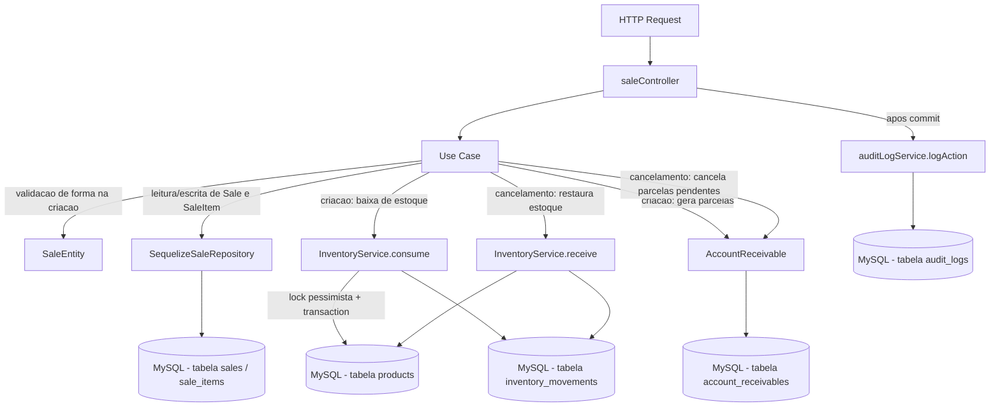

# Módulo Sales

## Objetivo

Gerenciar o ciclo de vida de Vendas ao cliente final: criação (com itens,
baixa de estoque e geração de parcelas em contas a receber) e transições de
status (`quote` → `confirmed` → `invoiced`/`canceled`). Migrado para a
arquitetura em camadas (`domain` / `application` / `infrastructure` /
`presentation`) descrita na Fase 5 do `TODO.md`, seguindo o mesmo padrão
dos módulos `products`, `inventory`, `bom`, `production` e `purchases`.

Este módulo **não reimplementa** a lógica transacional de baixa/entrada de
estoque — isso continua 100% centralizado em
`server/src/services/inventoryService.js` (`InventoryService.consume` na
criação da venda, `InventoryService.receive` no cancelamento). Os use cases
deste módulo são wrappers finos sobre os models Sequelize existentes
(`Sale`, `SaleItem`, `Product`, `Client`, `AccountReceivable`) e sobre
`InventoryService`.

## Decisão de compatibilidade de rotas

O endpoint `/api/sales` (mesmos 4 paths, métodos e formato de resposta
JSON do controller legado) agora é servido pelas rotas/controller deste
módulo (`presentation/routes/sales.js` →
`presentation/controllers/saleController.js`), registrado em
`server/index.js`.

O arquivo legado `server/src/routes/sales.js` e o controller
`server/src/controllers/saleController.js` **permanecem no repositório**
como referência histórica, mas **não são mais montados em nenhuma rota** —
evitando duplicidade de `/api/sales` e o risco de duas implementações
divergentes atenderem à mesma URL. Confirmado via `grep` que apenas
`server/index.js` monta o módulo novo. Os arquivos legados podem ser
removidos em uma limpeza futura, uma vez confirmada a estabilidade da
migração.

A rota legada importava `authorize` de `../middlewares/auth` mas nunca o
utilizava em nenhum handler — apenas `authenticate` era aplicado às 4
rotas. Esse comportamento foi preservado 1:1 no módulo novo (nenhuma rota
de vendas exige papel/permissão específica hoje; ver seção "Permissões").

Nenhum client precisa mudar: mesmos 4 endpoints, mesmos verbos HTTP, mesmo
envelope `{ success, data }` / `{ success, error }` (respostas de
sucesso). Uma pequena diferença de formato existe apenas nas respostas de
**erro** (mesmo padrão já adotado nos módulos `inventory`/`bom`/`production`/
`purchases`): erros de validação/regra de negócio agora são instâncias de
`AppError` (`server/src/errors`) e chegam ao cliente como
`{ success: false, error: { code, message } }` em vez do
`{ success: false, error: "mensagem em string" }` usado pelo controller
legado. Erros propagados de `InventoryService` (que ainda usa
`Object.assign(new Error(...), { statusCode })`, não `AppError`) continuam
retornando `{ success: false, error: "mensagem" }` (string), pois o
`errorHandler` central já trata esse formato legado separadamente — nenhuma
mudança de contrato nesse caso específico. O `statusCode` HTTP retornado é
o mesmo em todos os casos (400, 404, 409, 422). Erros inesperados (5xx)
mantêm o fallback genérico do `errorHandler`, igual ao legado.

## F24 — Arredondamento de parcelas (já corrigido antes desta migração)

O `TODO.md` lista F24 como uma dívida técnica relacionada a arredondamento
impreciso de parcelas em `saleController.js`. **Essa correção já havia sido
aplicada antes desta migração** (o controller legado já calculava tudo em
centavos usando helpers locais `toCents`/`fromCents`, com a última parcela
absorvendo o resto da divisão inteira). Esta migração **não altera a
regra**, apenas troca os helpers locais duplicados por
`server/src/shared/utils/money.js` (`toCents`/`fromCents`/`round2`), que já
existiam e eram usados por outros módulos migrados — evitando duas
implementações levemente distintas (`fromCents` local usava
`toFixed`/`parseFloat`; a versão compartilhada usa correção por
`Number.EPSILON` antes de `Math.round`, mais robusta para os mesmos casos
de uso). Comportamento numérico observável preservado para todos os valores
em reais/centavos normais de venda.

Fluxo preservado em `CreateSaleUseCase`:
1. Cada item tem seu `unit_price` convertido para centavos (`toCents`) e o
   total da venda é acumulado em centavos.
2. O desconto é convertido para centavos e subtraído do total.
3. Se `installments > 1`: `baseInstallmentCents = Math.floor(totalNetCents / installments)`
   e o resto (`totalNetCents % installments`) é somado exclusivamente à
   **última** parcela, garantindo que a soma das parcelas seja sempre
   exatamente igual ao total líquido da venda (nenhum centavo perdido ou
   sobrando por arredondamento).
4. Se `installments === 1`: uma única `AccountReceivable` já é criada com
   `status: 'paid'` (comportamento legado preservado — venda à vista é
   considerada quitada na criação).

## F22 — Reserva de estoque em quotes (pendência conhecida, não resolvida nesta migração)

O enum de `status` da venda inclui `'quote'` e a máquina de estados
(`ChangeSaleStatusUseCase.VALID_TRANSITIONS`) permite a transição
`quote → confirmed`. **Porém, hoje não existe nenhum fluxo real que crie
uma venda com `status: 'quote'`**: `CreateSaleUseCase` sempre cria a venda
já com `status: 'confirmed'` e debita o estoque imediatamente via
`InventoryService.consume`, dentro da mesma transação de criação.

Ou seja, o conceito de "orçamento" (quote) que reservaria estoque sem
debitá-lo de fato (ex.: usando `InventoryService.reserve`, que já existe
como "no-op defensivo" aguardando a coluna `reserved_quantity` no schema —
ver `server/src/services/inventoryService.js`) **não está implementado**.
Isso é uma pendência conhecida, documentada no `TODO.md` como F22, e
**permanece pendente após esta migração** — nenhuma mudança de
comportamento foi feita quanto a isso, apenas preservação 1:1 do fluxo
legado (que já tinha essa mesma lacuna).

## Estrutura

```
server/src/modules/sales/
  domain/
    entities/SaleEntity.js                   Validação de forma na criação
    repositories/SaleRepository.js           Interface do repositório
  application/
    use-cases/
      ListSalesUseCase.js
      GetSaleByIdUseCase.js
      CreateSaleUseCase.js                   Cálculo em centavos + baixa de estoque + parcelas (transacional)
      ChangeSaleStatusUseCase.js             Máquina de estados + cancelamento (restaura estoque, cancela parcelas)
  infrastructure/
    sequelize/SequelizeSaleRepository.js     Implementação usando os models existentes
  presentation/
    controllers/saleController.js
    routes/sales.js
```

## Modelos de dados utilizados

- `server/src/models/Sale.js` (Sequelize, reutilizado — nenhum model novo foi criado).
- `server/src/models/SaleItem.js`.
- `server/src/models/Product.js` (leitura na validação de itens; escrita de `quantity` feita exclusivamente por `InventoryService`).
- `server/src/models/Client.js` (associação `belongsTo`, apenas leitura — a existência do cliente não é validada explicitamente na criação, mesmo comportamento do legado).
- `server/src/models/AccountReceivable.js` (parcelas geradas na criação da venda; canceladas em massa no cancelamento).

## Regras de negócio

- Criação: `customer_id` obrigatório; `items` não pode ser vazio; cada item precisa de `product_id`/`quantity > 0`/`unit_price > 0` (validado por `SaleEntity`); `installments >= 1`; `discount >= 0`. Cada produto referenciado deve existir, estar `status: 'active'` e ter estoque suficiente (validado no use case, dentro da transação, e revalidado sob lock por `InventoryService.consume`). `total_amount` é calculado no backend em centavos a partir dos itens e do desconto.
- Baixa de estoque: `InventoryService.consume` por item, com lock pessimista (`SELECT ... FOR UPDATE`) na mesma transação da criação da venda — previne condição de corrida entre vendas concorrentes do mesmo produto (corrigida na Fase 4.1, preservada aqui).
- Geração de parcelas: ver seção F24 acima.
- Máquina de estados (`ChangeSaleStatusUseCase.VALID_TRANSITIONS`, single source of truth):
  - `quote` → `confirmed` | `canceled`
  - `confirmed` → `invoiced` | `canceled`
  - `invoiced` → `canceled`
  - `canceled` → (terminal, sem transições)
- Cancelamento (`status: 'canceled'`): restaura o estoque de cada item da venda via `InventoryService.receive` (mesma transação) e cancela (`status: 'canceled'`) todas as `AccountReceivable` da venda que ainda não estejam `paid`/`canceled`.

## Endpoints

Base URL: `/api/sales` (autenticação obrigatória via middleware `authenticate` em todas as rotas).

| Método | Rota | Descrição |
|---|---|---|
| GET | `/api/sales` | Lista vendas (filtros: `status`, `customer_id`, `start_date`, `end_date`; paginação: `page`, `limit`) |
| GET | `/api/sales/:id` | Busca venda por id (com cliente e itens + produto) |
| POST | `/api/sales` | Cria venda com itens — transacional; debita estoque e gera parcelas |
| PUT | `/api/sales/:id/status` | Altera status (máquina de estados) — transacional; ao cancelar, restaura estoque e cancela parcelas pendentes |

Ver `docs/API.md` para exemplos completos de request/response.

## Permissões

Todas as rotas exigem JWT válido (`authenticate`). O projeto ainda não
possui um middleware de RBAC granular por rota neste módulo — qualquer
usuário autenticado pode criar/cancelar vendas hoje. Isso está listado
como pendência na Fase 12 do `TODO.md` ("Revisar RBAC completo"), mesma
pendência documentada nos demais módulos migrados.

## Eventos / Auditoria

Todos os endpoints de escrita continuam chamando `logAction` (via
`server/src/services/auditLogService.js`) após o `commit`/persistência
(para não segurar locks de banco durante a escrita do log), preservando o
comportamento do controller legado:

- `create` → entidade `Sale` criada.
- `status_change` → mudança de status da venda.

`GET /` e `GET /:id` são somente leitura e não geram auditoria, mesmo
comportamento do legado.

## Fluxo simplificado (Mermaid)



## Testes existentes

Nenhum teste automatizado existe hoje para este módulo (nem para o
restante do projeto — `server/tests/` ainda não existe). Cobertura de
testes unitários de `SaleEntity`/use cases e testes de integração dos
endpoints está prevista na Fase 9 do `TODO.md`.

## Pendências conhecidas

- **F22 — reserva de estoque em quotes**: não implementada (ver seção
  dedicada acima) — toda venda é criada já `confirmed`, com débito
  imediato de estoque; não existe fluxo real de `'quote'`.
- Não há RBAC granular por papel neste módulo (qualquer usuário
  autenticado pode criar/cancelar vendas).
- A existência do `customer_id` não é validada explicitamente na criação
  (mesma lacuna do controller legado — uma FK inválida cai no tratamento
  genérico de `SequelizeForeignKeyConstraintError` do `errorHandler`).
- Validação de entrada é manual/via entidade (sem schema declarativo);
  migração para Zod está prevista para a Fase 8.
- O controller/rota legados (`server/src/controllers/saleController.js`,
  `server/src/routes/sales.js`) foram deixados intactos no repositório
  como referência histórica, mas não são mais usados; podem ser removidos
  em limpeza futura.
