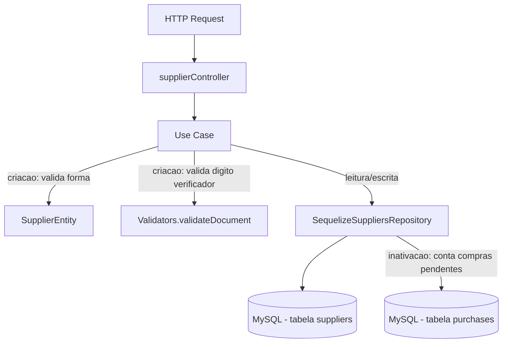

# Módulo Suppliers

## Objetivo

Gerenciar o cadastro de fornecedores da fábrica: listagem com
busca/filtro/paginação, consulta individual, criação (com validação de
CNPJ), atualização de dados cadastrais e inativação (soft delete via
`status='inactive'`), bloqueada quando o fornecedor possui pedidos de
compra pendentes. Migrado para a arquitetura em camadas (`domain` /
`application` / `infrastructure` / `presentation`) descrita na Fase 5/6 do
`TODO.md`, seguindo o mesmo padrão dos módulos `users`, `products`,
`inventory`, `bom`, `production`, `purchases`, `sales` e `financial`.

Este módulo **não reimplementa** a validação de dígito verificador do
CNPJ: reutiliza `Validators.validateDocument`
(`server/src/utils/validators.js`), chamada pelo use case
`CreateSupplierUseCase`, e `Validators.sanitizeSearch` para sanitizar o
termo de busca em `ListSuppliersUseCase` — mesmas funções já usadas pelo
controller legado, sem duplicação.

## Decisão de compatibilidade de rotas

O endpoint `/api/suppliers` (mesmos 5 paths, métodos, middlewares e
formato de sucesso JSON do controller legado) agora é servido pelas
rotas/controller deste módulo (`presentation/routes/suppliers.js` →
`presentation/controllers/supplierController.js`), registrado em
`server/index.js`.

O arquivo legado `server/src/routes/suppliers.js` e o controller
`server/src/controllers/supplierController.js` **permanecem no
repositório** como referência histórica, mas **não são mais montados em
nenhuma rota** — evitando duplicidade de `/api/suppliers` e o risco de
duas implementações divergentes atenderem à mesma URL. Confirmado via
`grep` que apenas `server/index.js` monta o módulo novo
(`require('./src/modules/suppliers/presentation/routes/suppliers')`),
nenhuma outra ocorrência de `require('./src/routes/suppliers')` existe no
arquivo. Os arquivos legados podem ser removidos em uma limpeza futura,
uma vez confirmada a estabilidade da migração.

Nenhum client precisa mudar quanto a **sucesso**: mesmos 5 endpoints,
mesmos verbos HTTP, mesmo middleware (`authenticate` em **todas** as
rotas, sem `authorize` por papel — preservado 1:1 do legado, que já não
restringia este módulo por role).

Uma diferença de formato existe apenas nas respostas de **erro** (mesmo
padrão já adotado nos módulos `auth`/`inventory`/`bom`/`production`/
`purchases`/`sales`/`financial`/`users` migrados anteriormente): erros de
validação/negócio agora são instâncias de `AppError`
(`server/src/errors`). Como `ValidationError`/`NotFoundError`/`ConflictError`
são subclasses de `AppError`, o `errorHandler`
(`server/src/middlewares/errorHandler.js`) entra no primeiro branch
(`err instanceof AppError`) e devolve
`{ success: false, error: { code, message } }` — um **objeto**, não mais a
string simples usada pelo controller legado (`{ success: false, error: "mensagem" }`).
O `statusCode` HTTP continua o mesmo em todos os casos do legado (400, 404,
409); não há desvio de status nesta migração, só do formato do corpo de
erro (mesma mudança já documentada nos demais módulos migrados).

Mapeamento das mensagens de erro do legado para os novos tipos de
`AppError` (mesma mensagem textual, `statusCode` preservado):

| Situação | Legado | Novo |
|---|---|---|
| Fornecedor não encontrado (`GET`/`PUT`/`DELETE :id`) | `404` string | `NotFoundError` (404) |
| `company_name`/`cnpj` ausentes na criação | `400` string | `ValidationError` (400) |
| CNPJ com dígito verificador inválido | `400` string | `ValidationError` (400) |
| CNPJ duplicado (constraint única) | `409` string | `ConflictError` (409) |
| Inativação bloqueada por compras pendentes | `400` string | `ValidationError` (400) |

## Estrutura

```
server/src/modules/suppliers/
  domain/
    entities/SupplierEntity.js              Validação de forma na criação (company_name/cnpj obrigatórios)
    repositories/SuppliersRepository.js     Interface do repositório
  application/
    use-cases/
      ListSuppliersUseCase.js               Busca/filtro/paginação
      GetSupplierByIdUseCase.js             Busca por id
      CreateSupplierUseCase.js              Valida CNPJ via Validators.validateDocument, salva CNPJ limpo
      UpdateSupplierUseCase.js              Atualiza campos permitidos
      DeactivateSupplierUseCase.js          Soft delete (status='inactive'), bloqueia se houver compras pendentes
  infrastructure/
    sequelize/SequelizeSuppliersRepository.js Implementação usando os models Supplier/Purchase existentes
  presentation/
    controllers/supplierController.js
    routes/suppliers.js
```

## Modelos de dados utilizados

- `server/src/models/Supplier.js` (Sequelize, reutilizado — nenhum model
  novo foi criado por este módulo).
- `server/src/models/Purchase.js` (usado apenas para contar pedidos de
  compra pendentes ao inativar um fornecedor; não incluído nas queries de
  listagem, mesmo comportamento do legado).

## Regras de negócio

- **Listagem** (`list`): busca por `company_name`/`cnpj` (`LIKE`,
  sanitizada via `Validators.sanitizeSearch`), filtro exato por `status`,
  paginação (`page`/`limit`, default `1`/`10`), ordenado por
  `company_name ASC`.
- **Criação** (`create`): `company_name` e `cnpj` obrigatórios; CNPJ
  validado via `Validators.validateDocument` (dígito verificador); CNPJ
  salvo sem formatação (`replace(/[^\d]/g, '')`); `rating` sempre `3`
  (default), `status` sempre `'active'`; `delivery_time` default `15`
  dias; CNPJ duplicado retorna 409.
- **Atualização** (`update`): aceita apenas os campos cadastrais/endereço
  permitidos (`company_name`, `trade_name`, `ie`, `phone`, `email`, `cep`,
  `street`, `number`, `complement`, `neighborhood`, `city`, `state`,
  `contact_name`, `contact_phone`, `payment_terms`, `delivery_time`,
  `rating`, `notes`); não permite alterar `cnpj` nem `status` por este
  endpoint, mesmo comportamento do legado.
- **Inativação (soft delete)** (`remove`): define `status='inactive'`;
  **bloqueia** a inativação se o fornecedor possuir pedidos de compra com
  status `pending`/`approved`/`sent`/`partial` (mensagem inclui a
  quantidade de pedidos pendentes).

## Endpoints

Base URL: `/api/suppliers`.

| Método | Rota | Middlewares | Descrição |
|---|---|---|---|
| GET | `/api/suppliers` | `authenticate` | Lista fornecedores (busca/filtro/paginação) |
| GET | `/api/suppliers/:id` | `authenticate` | Busca um fornecedor pelo id |
| POST | `/api/suppliers` | `authenticate` | Cria um novo fornecedor |
| PUT | `/api/suppliers/:id` | `authenticate` | Atualiza dados cadastrais |
| DELETE | `/api/suppliers/:id` | `authenticate` | Inativa (soft delete) um fornecedor |

Ver `docs/API.md` (seção "12. Fornecedores") para exemplos completos de
request/response.

## Permissões

Todas as rotas exigem apenas JWT válido (`authenticate`) — não há
`authorize` por papel neste módulo, mesma regra do controller/rotas
legados, sem mudança de RBAC nesta migração. RBAC mais granular está
listado como pendência na Fase 12 do `TODO.md` ("Revisar RBAC completo"),
mesma pendência documentada nos demais módulos migrados.

## Eventos / Auditoria

**Nenhum endpoint deste módulo chama `logAction`** — o controller legado
(`server/src/controllers/supplierController.js`) nunca teve integração
com `auditLogService`, e este comportamento foi preservado
intencionalmente nesta migração (instrução explícita: não adicionar
auditoria que não existia). Diferente de `users`/`purchases`/`financial`,
criação, atualização e inativação de fornecedores **não geram registro em
`audit_logs`** hoje.

## Fluxo simplificado (Mermaid)



## Testes existentes

Nenhum teste automatizado existe hoje para este módulo (nem para o
restante do projeto — `server/tests/` ainda não existe). Cobertura de
testes unitários de `SupplierEntity`/use cases e testes de integração dos
5 endpoints está prevista na Fase 9 do `TODO.md`.

## Pendências conhecidas

- **Sem auditoria (`AuditLog`)**: nenhuma escrita neste módulo (criação,
  atualização, inativação) gera registro em `audit_logs`, diferente da
  maioria dos demais módulos já migrados (`users`, `purchases`,
  `financial`, etc.). Isso já era verdade no controller legado; recomenda-se
  avaliar a adição de `logAction` em uma iteração futura para rastreabilidade
  de alterações cadastrais de fornecedores.
- Não há `authorize` por papel neste módulo — qualquer usuário autenticado
  pode criar, atualizar ou inativar fornecedores.
- Validação de entrada é manual/via entidade (sem schema declarativo);
  migração para Zod está prevista para a Fase 8.
- O controller/rota legados (`server/src/controllers/supplierController.js`,
  `server/src/routes/suppliers.js`) foram deixados intactos no repositório
  como referência histórica, mas não são mais usados; podem ser removidos
  em limpeza futura.
