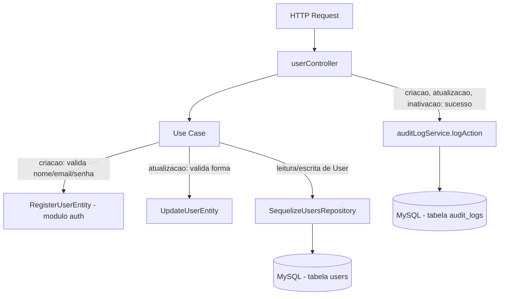

# Módulo Users

## Objetivo

Gerenciar o cadastro administrativo de usuários do ERP (CRUD): listagem
com busca/filtro/paginação, consulta individual, criação, atualização de
dados cadastrais (sem senha) e inativação (soft delete). Distinto do
módulo `auth`, que trata login, o próprio registro (`POST /api/auth/register`,
mesma regra de negócio) e leitura do usuário autenticado (`GET /api/auth/me`).
Migrado para a arquitetura em camadas (`domain` / `application` /
`infrastructure` / `presentation`) descrita na Fase 5 do `TODO.md`,
seguindo o mesmo padrão dos módulos `auth`, `products`, `inventory`, `bom`,
`production`, `purchases`, `sales` e `financial`.

Este módulo **não reimplementa** a validação de nome/email/senha de
criação de usuário: reutiliza `RegisterUserEntity`, já existente em
`server/src/modules/auth/domain/entities/AuthCredentialsEntity.js`, pois as
regras são idênticas às do controller legado (`name`/`email`/`password`
obrigatórios, email com formato válido, senha com no mínimo 6 caracteres).
Hash de senha, `comparePassword` e sanitização de `password` nas respostas
continuam 100% centralizados no model `server/src/models/User.js`.

## Decisão de compatibilidade de rotas

O endpoint `/api/users` (mesmos 5 paths, métodos, middlewares e formato de
sucesso JSON do controller legado) agora é servido pelas rotas/controller
deste módulo (`presentation/routes/users.js` →
`presentation/controllers/userController.js`), registrado em
`server/index.js`.

O arquivo legado `server/src/routes/users.js` e o controller
`server/src/controllers/userController.js` **permanecem no repositório**
como referência histórica, mas **não são mais montados em nenhuma rota** —
evitando duplicidade de `/api/users` e o risco de duas implementações
divergentes atenderem à mesma URL. Confirmado via `grep` que apenas
`server/index.js` monta o módulo novo
(`require('./src/modules/users/presentation/routes/users')`), nenhuma outra
ocorrência de `require('./src/routes/users')` existe no arquivo. Os
arquivos legados podem ser removidos em uma limpeza futura, uma vez
confirmada a estabilidade da migração.

Nenhum client precisa mudar quanto a **sucesso**: mesmos 5 endpoints,
mesmos verbos HTTP, mesmos middlewares (`authenticate` + `authorize('admin')`
em **todas** as rotas, sem exceção — preservado 1:1).

Uma diferença de formato existe apenas nas respostas de **erro** (mesmo
padrão já adotado nos módulos `auth`/`inventory`/`bom`/`production`/
`purchases`/`sales`/`financial` migrados anteriormente): erros de
validação/negócio agora são instâncias de `AppError` (`server/src/errors`)
e chegam ao cliente como `{ success: false, error: { code, message } }` em
vez do `{ success: false, error: "mensagem em string" }` usado pelo
controller legado. O `statusCode` HTTP é o mesmo em quase todos os casos
(400, 404, 409), com **uma exceção documentada abaixo** (auto-inativação).
Erros inesperados (5xx) mantêm o fallback genérico do `errorHandler`, igual
ao legado. `docs/API.md` (seção "1.1 Usuários (Gestão)") foi atualizado
para refletir o novo formato dos erros.

### Desvio 1:1 documentado: status HTTP da auto-inativação

O controller legado (`userController.js#remove`) respondia **400** para a
tentativa de um usuário inativar a si mesmo. Este módulo usa
`BusinessRuleError`, que mapeia para **422** — mesma convenção já adotada
por regras de negócio análogas em outros módulos migrados (ex.:
`purchases/application/use-cases/ChangePurchaseStatusUseCase.js`,
`ReceivePurchaseItemsUseCase.js`). A mensagem de erro
(`'Você não pode inativar seu próprio usuário'`) permanece idêntica; apenas
o código de status HTTP passa de 400 para 422 e o corpo passa a ser
`{ success: false, error: { code: 'BUSINESS_RULE_VIOLATION', message } }`.
Esse é o único desvio de status HTTP desta migração; todas as demais
respostas de erro preservam o `statusCode` do legado.

## Estrutura

```
server/src/modules/users/
  domain/
    entities/UpdateUserEntity.js        Validação de forma do PUT (bloqueia senha, valida email) + VALID_ROLES
    repositories/UsersRepository.js     Interface do repositório
  application/
    use-cases/
      ListUsersUseCase.js               Busca/filtro/paginação
      GetUserByIdUseCase.js             Busca por id
      CreateUserUseCase.js              Reusa RegisterUserEntity (módulo auth) + valida role + audita
      UpdateUserUseCase.js              Atualiza campos permitidos, audita oldValues/newValues
      DeactivateUserUseCase.js          Soft delete (active=false), bloqueia auto-inativação, audita
  infrastructure/
    sequelize/SequelizeUsersRepository.js Implementação usando o model User existente
  presentation/
    controllers/userController.js
    routes/users.js
```

## Modelos de dados utilizados

- `server/src/models/User.js` (Sequelize, reutilizado — nenhum model novo
  foi criado). Fornece hash de senha via hook `beforeSave` e
  `comparePassword` (não usados diretamente por este módulo, apenas pelo
  módulo `auth`). Todas as leituras deste módulo excluem `password` via
  `attributes: { exclude: ['password'] }`, mesmo comportamento do legado.

## Regras de negócio

- **Listagem:** busca por `name`/`email` (`LIKE`), filtros exatos por
  `role` e `active`, paginação (`page`/`limit`, default `1`/`10`), ordenado
  por `createdAt DESC`.
- **Criação:** `name`/`email`/`password` obrigatórios; email deve casar com
  a regex `/^[^\s@]+@[^\s@]+\.[^\s@]+$/`; senha deve ter no mínimo 6
  caracteres — validado por `RegisterUserEntity`, reutilizada do módulo
  `auth` (não duplicada). `role`, quando informado, deve ser um de
  `'admin'|'operator'|'financial'`; padrão `'operator'`. Email duplicado
  (constraint única do banco) retorna 409 com mensagem
  `'Email já cadastrado'`. Toda criação é auditada via `logAction`.
- **Atualização:** aceita apenas `name`/`email`/`role`/`active`
  (update parcial); **bloqueia** qualquer tentativa de enviar `password`
  neste endpoint (`'Use endpoint específico para alterar senha'`); valida
  formato de email quando informado. Email duplicado retorna 409. Toda
  atualização é auditada com `oldValues`/`newValues` dos campos alterados.
- **Inativação (soft delete):** define `active=false`; **bloqueia**
  auto-inativação (usuário autenticado não pode inativar a si mesmo — ver
  "Desvio 1:1 documentado" acima quanto ao status HTTP). Toda inativação é
  auditada via `logAction`.

## Endpoints

Base URL: `/api/users`.

| Método | Rota | Middlewares | Descrição |
|---|---|---|---|
| GET | `/api/users` | `authenticate`, `authorize('admin')` | Lista usuários (busca/filtro/paginação) |
| GET | `/api/users/:id` | `authenticate`, `authorize('admin')` | Busca um usuário pelo id |
| POST | `/api/users` | `authenticate`, `authorize('admin')` | Cria um novo usuário |
| PUT | `/api/users/:id` | `authenticate`, `authorize('admin')` | Atualiza dados cadastrais (sem senha) |
| DELETE | `/api/users/:id` | `authenticate`, `authorize('admin')` | Inativa (soft delete) um usuário |

Ver `docs/API.md` (seção "1.1 Usuários (Gestão)") para exemplos completos
de request/response.

## Permissões

Todas as rotas exigem JWT válido e papel `'admin'` (`authorize('admin')`) —
mesma regra do controller/rotas legados, sem exceção e sem mudança de RBAC
nesta migração.

## Eventos / Auditoria

`POST /`, `PUT /:id` e `DELETE /:id` chamam `logAction` (via
`server/src/services/auditLogService.js`) em caso de sucesso, preservando
o comportamento do controller legado: `create` registra `newValues`
(name/email/role); `update` registra `oldValues`/`newValues` apenas dos
campos alterados; `soft_delete` registra a transição `active: true → false`.
`GET /` e `GET /:id` não geram auditoria (leituras), mesmo comportamento do
legado.

## Fluxo simplificado (Mermaid)



## Testes existentes

Nenhum teste automatizado existe hoje para este módulo (nem para o
restante do projeto — `server/tests/` ainda não existe). Cobertura de
testes unitários dos use cases e testes de integração dos 5 endpoints está
prevista na Fase 9 do `TODO.md`.

## Pendências conhecidas

- Não existe endpoint dedicado para troca de senha pelo próprio usuário ou
  por um admin neste módulo — mesma lacuna do legado (fora de escopo desta
  migração).
- Validação de entrada é manual/via entidade (sem schema declarativo);
  migração para Zod está prevista para a Fase 8.
- O controller/rota legados (`server/src/controllers/userController.js`,
  `server/src/routes/users.js`) foram deixados intactos no repositório
  como referência histórica, mas não são mais usados; podem ser removidos
  em limpeza futura.
